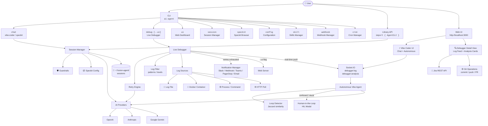
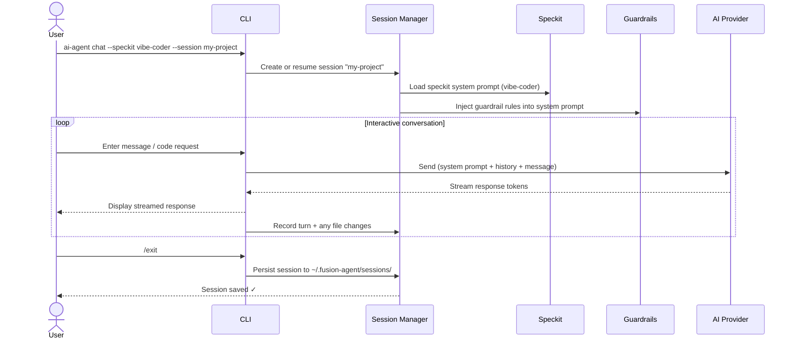
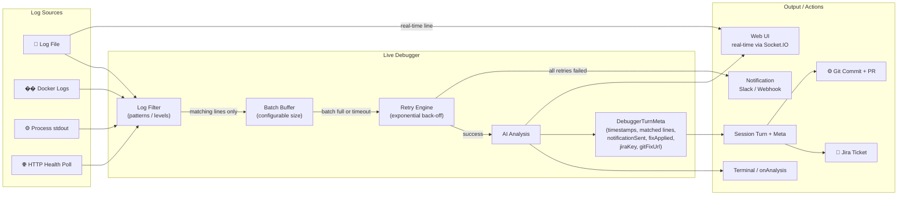
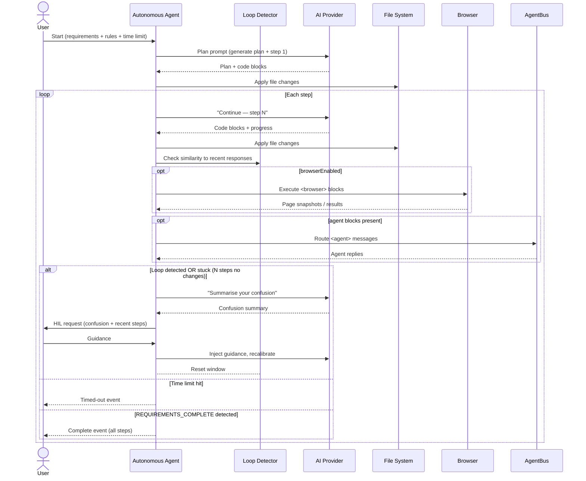

# fusion-agent

> ⚠️ **Package renamed:** The previous npm package has been deprecated and replaced by **`fusion-agent`**.  
> Please install the new package: `npm install -g fusion-agent`

An AI-powered **vibe coder**, **live service debugger**, **autonomous agent**, and **session manager** — deployable as a CLI or importable as a TypeScript library.

Supports **OpenAI**, **Anthropic**, and **Google Gemini** with streaming responses.

---

## Features

| Feature                             | Description                                                                                                                                    |
| ----------------------------------- | ---------------------------------------------------------------------------------------------------------------------------------------------- |
| 🤖 Vibe Coder                       | AI pair-programmer that reads your project context, generates, and refactors code                                                              |
| ⚡ Vibe Coder — Autonomous Mode     | Give it a requirements file and rules; it codes end-to-end until done, with loop-detection and human-in-the-loop (HIL) escalation              |
| 🔍 Live Debugger                    | Attach to running services (log files, Docker, processes, HTTP) and get real-time AI analysis                                                  |
| 🌐 Live Debugger + Web UI           | Run `--ui` alongside the debugger to see a live dashboard with log feeds, AI analysis cards, and action buttons                                |
| 🔁 Debugger — Retry & Notifications | Configurable AI retry with exponential back-off; notify via Slack / webhook when retries are exhausted                                         |
| 🔎 Debugger — Log Filtering         | Restrict analysis to specific log patterns (regex) or log levels (ERROR, WARN, …)                                                              |
| 🎫 Jira Integration                 | Create Jira tickets directly from Live Debugger analysis events, with per-integration guardrails                                               |
| ⚙ Git Integration                   | Apply AI-proposed code fixes to a git repository, push, and open a pull request, with per-integration guardrails                               |
| 📦 Speckits                         | 7 prebuilt agent configurations: vibe-coder, debugger, code-review, doc-writer, test-writer, refactor, security-audit                          |
| 🧩 Skills Registry                  | Install domain-expert SKILL.md files; the autonomous agent loads and applies them automatically at runtime                                     |
| 🌐 Browser Control                  | Autonomous agent can navigate pages, take snapshots, click, type, and evaluate JS via `<browser>` response blocks (requires Chrome/Chromium)   |
| 🤝 Agent-to-Agent Routing           | Multiple autonomous agents running in the same process can exchange messages via `<agent>` response blocks and an in-memory AgentBus           |
| 🔔 Webhooks                         | Register HTTP webhooks that trigger an autonomous agent run on demand; tokens are SHA-256 hashed and validated with timing-safe comparison      |
| ⏰ Cron Scheduler                   | Schedule autonomous agent runs with standard cron expressions; jobs persist across restarts via `~/.fusion-agent/cron.json`                    |
| 🛡 Guardrails                       | Per-session rules the AI must follow (allowed paths, denied operations, style rules, custom rules)                                             |
| 💾 Sessions                         | Named, persistent sessions with full conversation history, file-change tracking, and rich debugger metadata                                    |
| 🌐 Web UI                           | Built-in web dashboard — session viewer, **interactive Vibe Coder chat**, **Autonomous Mode control panel**, and **Live Debugger detail view** |
| 📚 Library API                      | Importable TypeScript module for programmatic use                                                                                              |

---

## Architecture & Flow

### High-Level Architecture



---

### Chat Session Flow



---

### Live Debugger Flow (with `--ui`)



---

### Autonomous Vibe Coder Flow



---

## Installation

```bash
# Global install (recommended for CLI use)
npm install -g fusion-agent

# Dev dependency (for programmatic use)
npm install --save-dev fusion-agent
```

---

## Quick Start

### Set your API key

```bash
export OPENAI_API_KEY=sk-...
# or
export ANTHROPIC_API_KEY=sk-ant-...
# or
export GEMINI_API_KEY=AIza...
```

### Start coding

```bash
ai-agent chat
```

### Debug a live service

```bash
# Basic — terminal output only
ai-agent debug --file /var/log/myapp.log

# With Web UI dashboard alongside the debugger
ai-agent debug --file /var/log/myapp.log --ui

# Watch only ERROR/FATAL lines, with custom session name
ai-agent debug --docker my-container --log-level ERROR,FATAL --session live-debugger-prod --ui
```

### Launch Web UI (includes Vibe Coder + Debugger sessions)

```bash
ai-agent ui
# Open http://localhost:3000
```

---

## CLI Reference

```
Usage: ai-agent [options] [command]

Commands:
  chat [options]          Start an interactive chat session (vibe coder mode)
  speckit [name]          List or run a prebuilt speckit
  debug [options]         Attach to a live service and start AI-assisted debugging
  session [options]       Manage sessions (list, delete, export)
  ui [options]            Launch the Web UI
  config [options]        Configure default settings
  skill [subcommand]      Manage installed skills (list | show <name> | fetch <name> <url>)
  webhook <action>        Manage autonomous agent webhooks (list | add | remove <id>)
  cron <action>           Manage scheduled autonomous runs (list | add | remove | enable | disable)
  cluster-debug [options] Monitor cluster services and auto-debug failures

Options:
  -V, --version      output the version number
  -h, --help         display help for command
```

### `ai-agent chat`

```bash
ai-agent chat [options]

Options:
  -p, --provider <provider>  AI provider (openai|anthropic|gemini)
  -m, --model <model>        Model name (e.g. gpt-4o)
  -s, --session <name>       Session name — creates or resumes (default: "default")
  -k, --speckit <speckit>    Speckit to use (default: vibe-coder)
  -g, --guardrail <rule>     Add a guardrail rule (repeatable)
  --context                  Inject project directory structure as context
```

#### Interactive commands

Inside a chat session:

| Command            | Action                         |
| ------------------ | ------------------------------ |
| `/exit` or `/quit` | End session and save           |
| `/save`            | Save current session           |
| `/turns`           | Show conversation history      |
| `/context`         | Inject current project context |

### `ai-agent speckit`

```bash
ai-agent speckit           # list all speckits
ai-agent speckit vibe-coder  # show details of a speckit
```

### `ai-agent debug`

```bash
ai-agent debug [options]

Connection (one required):
  -f, --file <logFile>       Watch a log file
  -d, --docker <container>   Attach to Docker container logs
  -c, --cmd <command>        Run and attach to a process command

Session:
  -s, --session <name>       Session name (default: live-debugger-<id>)
                             Appears in the Sessions tab with a 🔍 prefix

Web UI:
  --ui                       Launch the Web UI alongside the debugger.
                             The debugger session is immediately visible in the
                             Sessions tab with a live log feed and AI analysis cards.
  --port <port>              Web UI port when --ui is used (default: 3000)

Analysis tuning:
  --batch <n>                Lines to accumulate before analysis (default: 20)
  --log-pattern <patterns>   Comma-separated regex patterns; only matching lines
                             are analysed. Overrides the default error-keyword gate.
  --log-level <levels>       Comma-separated log levels to watch (e.g. ERROR,WARN,FATAL)
  --log-token-limit <n>      Maximum number of tokens to include in a single AI prompt.
                             Oldest log lines are trimmed first to stay within budget.
                             When omitted the limit is extracted automatically from
                             the first 429 "Request too large" error and applied to
                             all subsequent flushes. (~4 chars per token estimate)

Resilience:
  --retry <n>                AI retry attempts on failure (default: 3)
  --retry-delay <ms>         Base retry delay in ms — doubles each attempt (default: 1000)

Notifications (sent when all retries are exhausted):
  --notify-slack <url>       Slack incoming webhook URL
  --notify-teams <url>       Microsoft Teams webhook URL
  --notify-webhook <url>     Generic HTTP webhook URL

Other:
  -p, --provider <provider>  AI provider
  -m, --model <model>        Model name
```

**Examples:**

```bash
# Watch only ERROR and FATAL lines
ai-agent debug --file app.log --log-level ERROR,FATAL

# Watch lines matching a custom pattern and open the Web UI
ai-agent debug --docker my-api --log-pattern "OOM|killed|segfault" --ui

# Cap prompt size to avoid 429 token-limit errors
ai-agent debug --docker my-container --log-token-limit 25000

# Retry up to 5 times, then post to Slack, with a custom session name
ai-agent debug --file app.log --retry 5 --notify-slack https://hooks.slack.com/... \
  --session live-debugger-prod --ui --port 4000
```

### `ai-agent session`

```bash
ai-agent session --list           # List all sessions
ai-agent session --delete <id>    # Delete a session
ai-agent session --export <id>    # Print session JSON
```

### `ai-agent ui`

```bash
ai-agent ui               # Start on default port 3000
ai-agent ui --port 8080   # Custom port
```

### `ai-agent config`

```bash
ai-agent config --show              # Show current config
ai-agent config --provider openai   # Set default provider
ai-agent config --model gpt-4o      # Set default model
ai-agent config --port 3000         # Set default Web UI port
```

### `ai-agent skill`

```bash
ai-agent skill list                              # List installed skills
ai-agent skill show react-expert                 # Print a skill's content
ai-agent skill fetch react-expert https://…/SKILL.md  # Fetch and cache a remote skill
```

Skills live in `~/.fusion-agent/skills/<name>/SKILL.md`. Install any number of them and reference them by name in the autonomous agent via `skills: ['react-expert']`.

### `ai-agent webhook`

```bash
ai-agent webhook list                            # List registered webhooks
ai-agent webhook add --name deploy-hook --session my-project --requirements "Run smoke tests"
# → prints the webhook ID and a one-time secret token

ai-agent webhook remove <id>                     # Delete a webhook by ID
```

Trigger a registered webhook from any HTTP client:

```bash
curl -X POST https://your-server/api/webhooks/<id>/trigger \
  -H "X-Webhook-Token: <token>"
```

The server starts an autonomous agent run for the configured session and requirements (fire-and-forget, responds with `202 Accepted`).

### `ai-agent cron`

```bash
ai-agent cron list                               # List all scheduled jobs
ai-agent cron add \
  --name morning-review \
  --schedule "0 9 * * 1-5" \
  --session my-project \
  --requirements "Review open PRs and summarise overnight CI failures"

ai-agent cron remove <id>                        # Remove a job
ai-agent cron disable <id>                       # Temporarily pause a job
ai-agent cron enable <id>                        # Resume a paused job
```

Schedules use standard cron syntax (powered by [node-cron](https://github.com/node-cron/node-cron)). Jobs are persisted to `~/.fusion-agent/cron.json` and restored automatically when the web server starts.

---

## Speckits

Speckits are pre-configured agent personas. Use `--speckit <name>` with `chat`.

| Name             | Description                                      |
| ---------------- | ------------------------------------------------ |
| `vibe-coder`     | Full-stack AI pair programmer (default)          |
| `debugger`       | Root-cause analysis and targeted code fixes      |
| `code-review`    | OWASP/quality review with severity grading       |
| `doc-writer`     | JSDoc, README, OpenAPI docs generation           |
| `test-writer`    | Unit and integration test generation             |
| `refactor`       | Structural refactoring without changing behavior |
| `security-audit` | OWASP Top 10 security vulnerability scan         |

```bash
ai-agent chat --speckit security-audit
```

---

## Guardrails

Guardrails are rules injected into the AI's system prompt to constrain its behavior.

```bash
# Only allow changes in src/
ai-agent chat -g "Only modify files within the src/ directory"

# Enforce code style
ai-agent chat -g "Always use TypeScript strict mode" -g "Prefer async/await over callbacks"

# Multiple guardrails
ai-agent chat \
  -g "Never delete files" \
  -g "Always write unit tests for new functions" \
  -g "Use camelCase for all variable names"
```

### Guardrail types (programmatic API)

```typescript
import { createGuardrail } from "fusion-agent";

createGuardrail("allow-paths", ["./src", "./tests"]);
createGuardrail("deny-paths", ["./node_modules", "./.env"]);
createGuardrail("deny-operations", ["delete", "overwrite"]);
createGuardrail("max-tokens", 2000);
createGuardrail("style", "Use functional programming patterns");
createGuardrail("custom", "Always add JSDoc to exported functions");
```

### Jira integration guardrails

Jira-specific guardrails are passed in `jiraConfig.guardrails` and operate on ticket content — they never reach the AI. Supported formats:

| Rule                     | Example                       | Effect                                                        |
| ------------------------ | ----------------------------- | ------------------------------------------------------------- |
| `deny-keyword:<word>`    | `deny-keyword:secret`         | Blocks tickets whose summary or description contains the word |
| `require-label:<label>`  | `require-label:live-debugger` | Ticket creation fails unless this label is present            |
| `max-summary-length:<n>` | `max-summary-length:100`      | Ticket creation fails if summary exceeds N characters         |

### Git integration guardrails

Git-specific guardrails are passed in `gitConfig.guardrails` and operate on the set of files being committed — the AI never directly touches the repo. Supported formats:

| Rule                  | Example              | Effect                                                |
| --------------------- | -------------------- | ----------------------------------------------------- |
| `allow-path:<prefix>` | `allow-path:src/`    | Only files under this prefix may be modified          |
| `deny-path:<prefix>`  | `deny-path:secrets/` | Files under this prefix are blocked from modification |
| `max-files:<n>`       | `max-files:5`        | Commit is rejected if it touches more than N files    |

---

## Configuration File

Create `.fusion-agent.json` in your project root:

```json
{
  "provider": "openai",
  "model": "gpt-4o",
  "port": 3000,
  "guardrails": [{ "type": "custom", "value": "Always use TypeScript" }]
}
```

Or `~/.fusion-agent/config.json` for global settings.

**API keys are never stored in config files** — use environment variables:

```bash
OPENAI_API_KEY=sk-...
ANTHROPIC_API_KEY=sk-ant-...
GEMINI_API_KEY=AIza...
AI_PROVIDER=openai
AI_MODEL=gpt-4o
AI_AGENT_PORT=3000
```

---

## Web UI

Start with `ai-agent ui` and open `http://localhost:3000`.

### Sessions Dashboard

View all sessions, status, provider, model, speckit, and file changes. Sessions created by the Live Debugger appear with a **🔍 prefix** (e.g. `🔍 live-debugger-k3x9p` or `🔍 live-debugger-prod`). Click any session to view its detail page.

### 🔍 Debugger Session Detail View

When you click on a debugger session (one with `speckit: 'debugger'`), you see a dedicated three-panel view:

#### Log Feed (left panel)

- Every log line that matched the configured filter is shown here with a timestamp chip.
- Matched lines (those that triggered an AI analysis) are highlighted in yellow.
- When **Subscribe Live** is active, new lines stream in from the running debugger in real time via Socket.IO.

#### AI Analysis Cards (middle panel)

Each batch of matched log lines that was sent to the AI produces one card:

| Card element                 | Description                                                                              |
| ---------------------------- | ---------------------------------------------------------------------------------------- |
| **Analysis #N** + timestamps | Sequential number, prompt-sent time, response-received time, and duration in ms          |
| **Prompt sent** (collapsed)  | Click to expand and see the exact prompt that was sent to the AI                         |
| **AI response**              | Full analysis with code-block rendering (same as Vibe Coder)                             |
| 🔔 **Notified** badge        | Shown if a Slack/webhook notification was dispatched for this event                      |
| 🔧 **Fix applied** badge     | Shown if a git fix was committed for this analysis                                       |
| **Jira key chip**            | e.g. `OPS-123` — shown after a ticket is created                                         |
| **Git fix chip**             | PR URL or commit SHA — shown after a git fix is applied                                  |
| **🎫 Create Jira Ticket**    | Opens the Jira modal to file a ticket from this analysis                                 |
| **⚙ Apply Git Fix**          | Opens the Git modal to commit AI-proposed code changes                                   |
| **🤖 Assign to Copilot**     | Opens the Copilot modal to file a GitHub issue and assign it to the Copilot coding agent |
| 🤖 **Copilot issue chip**    | Link to the GitHub issue — shown after a Copilot issue is created                        |

#### Info Panel (right panel)

Session metadata: ID, provider, model, speckit, created/updated times, configured guardrails.

#### Subscribe Live button

Click **Subscribe Live** to join the real-time Socket.IO room for this debugger session. The button changes to **● Live** with a green pulsing dot. All subsequent `debugger:log` and `debugger:analysis` events from the running debugger process appear instantly without a page refresh.

#### 🎫 Jira Modal

Fill in your Jira credentials once per session (not stored permanently):

| Field         | Description                                                                                  |
| ------------- | -------------------------------------------------------------------------------------------- |
| Jira Base URL | e.g. `https://yourorg.atlassian.net`                                                         |
| Email         | Your Atlassian account email                                                                 |
| API Token     | Generated at [id.atlassian.com](https://id.atlassian.com/manage-profile/security/api-tokens) |
| Project Key   | e.g. `OPS`, `INFRA`                                                                          |
| Issue Type    | Default: `Bug`                                                                               |
| Summary       | Pre-populated from the AI analysis; editable                                                 |
| Priority      | Highest / High / Medium / Low / Lowest                                                       |
| Labels        | Comma-separated labels                                                                       |
| Guardrails    | One rule per line (e.g. `deny-keyword:classified`)                                           |

Click **Create Ticket** — the ticket is created via `POST /api/debugger/:sessionId/jira` and the Jira key (e.g. `OPS-123`) immediately appears on the analysis card.

#### ⚙ Git Modal

| Field          | Description                                                                     |
| -------------- | ------------------------------------------------------------------------------- |
| Repo Path      | Absolute path to a local git repository (must already exist)                    |
| Token          | GitHub / GitLab personal access token for HTTPS pushes (optional if SSH)        |
| Remote URL     | e.g. `https://github.com/org/repo` — overrides the existing `origin` remote     |
| Branch         | Target branch (default: `fusion-agent/auto-fix`) — created if it does not exist |
| GitHub API URL | e.g. `https://api.github.com` — required to open a pull request                 |
| Commit Message | Defaults to `fix: apply AI-suggested fix from live debugger`                    |
| PR Title       | If set and GitHub API URL is provided, a pull request is opened after push      |
| Base Branch    | PR base (default: `main`)                                                       |
| Guardrails     | One rule per line (e.g. `allow-path:src/`, `deny-path:secrets/`)                |

Click **Apply Fix** — the AI-proposed code blocks are extracted from the analysis, written to disk, committed, and optionally pushed + PRed via `POST /api/debugger/:sessionId/git-fix`. The resulting PR URL or commit SHA appears on the analysis card.

#### 🤖 Copilot Modal

| Field          | Description                                                                  |
| -------------- | ---------------------------------------------------------------------------- |
| GitHub Token   | Personal access token with `repo` + `issues:write` scope                     |
| Repository URL | e.g. `https://github.com/org/repo`                                           |
| Assignee       | Default: `copilot` — the bot username that triggers the Copilot coding agent |
| Issue Title    | Pre-populated from the first line of the AI analysis; editable               |
| Labels         | Comma-separated labels applied to the issue                                  |

Click **🤖 Assign to Copilot** — a GitHub issue is created and immediately assigned. The Copilot coding agent picks it up and autonomously opens a fix PR. The **🤖 Copilot Issue** chip appears on the card linking to the issue.

> **Note:** When Copilot is assigned (manually or via `autoAssignCopilot`), the live debugger **does not apply its own git fix**. Fix responsibility is fully delegated to the Copilot coding agent. Use **⚙ Apply Git Fix** only when you want fusion-agent itself to commit and push the change.

**Auto-assign without clicking:** set `github.autoAssignCopilot: true` in your config file (see [End-to-End Examples](#end-to-end-examples)) to fire this automatically after every AI analysis.

### ⚡ Vibe Coder

The **Vibe Coder** page lets you run the AI pair-programmer directly in the browser. It has two tabs:

#### 💬 Chat Tab

Interactive chat mode identical to the CLI — but in the browser:

1. Enter a session name and (optionally) the path to your project directory on the server.
2. Click **New Session** to connect.
3. Type a prompt and press **Send** (or `Ctrl+Enter`).
4. The AI response streams in real time. Any file blocks in the response (` ```language:path/to/file ``` `) are automatically written to disk.
5. Changed files appear in the **Files Changed** panel on the right.
6. Click **📁** to inject the current project directory structure as context.

#### 🤖 Autonomous Tab

Give the agent a requirements file and let it code unattended:

| Setting                    | Description                                                                           |
| -------------------------- | ------------------------------------------------------------------------------------- |
| **Requirements file path** | Server-side path to a `.md` or `.txt` requirements file                               |
| **Paste requirements**     | Alternatively, paste requirements text directly                                       |
| **Rules**                  | Add one or more constraints the agent must follow (e.g. "Use TypeScript strict mode") |
| **Time limit**             | Stop automatically after N seconds (0 = no limit)                                     |
| **Max steps**              | Maximum iteration count before forcing a HIL check (default: 50)                      |

Click **▶ Run Autonomous** to start. The agent will:

1. Read the requirements and generate an implementation plan.
2. Implement each step, writing files to disk.
3. Check its own responses for repetition or lack of progress (loop detection).
4. If stuck or looping — it **asks you for help** via the HIL modal (see below).
5. Stop when it outputs `REQUIREMENTS_COMPLETE` or hits a limit.

#### 🤔 Human-in-the-Loop (HIL) Modal

When the autonomous agent detects it is confused, stuck, or generating repetitive output, it pauses and shows a modal dialog:

- **Why it stopped** — `loop-detected`, `stuck`, `error`, or `max-steps-reached`
- **Confusion summary** — the AI's own explanation of what is blocking it
- **Recent steps** — a quick review of the last few actions
- **Your guidance** — type what the agent should do differently, then click **Continue →**

The agent resumes with your guidance injected into the conversation.

### Settings

Configure the default AI provider and model used by the Web UI.

### Real-time updates

All pages use Socket.IO — streaming tokens, file-change notifications, live log lines, and AI analysis cards update in real time without page refresh.

---

## Library / Programmatic API

```typescript
import { AgentCLI, createGuardrail } from "fusion-agent";

// Create an agent instance
const agent = new AgentCLI({
  provider: "openai", // or 'anthropic', 'gemini'
  model: "gpt-4o",
  apiKey: process.env.OPENAI_API_KEY,
});

// One-shot chat
const response = await agent.chat("Write a hello world in Rust");
console.log(response);

// Session-based chat with guardrails
const session = agent.createSession({
  name: "my-project",
  speckit: "vibe-coder",
  guardrails: [
    createGuardrail("allow-paths", ["./src"]),
    createGuardrail("custom", "Always add TypeScript types"),
  ],
});

const turn = await session.chat("Add a user authentication middleware");
console.log(turn.assistantMessage);

// Apply a file change
session.applyFileChange("./src/middleware/auth.ts", "// new content...");

// Revert the change
session.revertTurnChanges(turn.id);

// Save session
agent.sessionManager.persistSession(session);
```

### Live Debugger API

```typescript
import { AgentCLI, LiveDebugger } from "fusion-agent";

const agent = new AgentCLI({ provider: "openai" });
const session = agent.createSession({
  name: "live-debugger-prod",
  speckit: "debugger",
});

const debugger_ = new LiveDebugger({
  session,
  batchSize: 20,

  // Resilience
  retryCount: 3, // retry up to 3 times (default)
  retryDelayMs: 1000, // 1 s base delay, doubles each attempt

  // Log filtering — omit both to accept all lines (default behaviour)
  logLevels: ["ERROR", "WARN", "FATAL"], // only these levels
  logPatterns: ["OOM", "killed"], // OR these patterns

  // Token budget: oldest lines are trimmed first to fit.
  // When omitted the limit is auto-detected from 429 errors.
  logTokenLimit: 25000,
  // Notification when all retries are exhausted
  notifications: {
    slack: { enabled: true, webhookUrl: "https://hooks.slack.com/..." },
  },

  // Optional: Socket.IO instance for real-time Web UI pushes
  // io: webServer.io,

  onLog: (line) => console.log(line),
  onAnalysis: (analysis, meta) => {
    console.log("AI:", analysis);
    // meta: { matchedLogLines, promptSentAt, responseReceivedAt,
    //         notificationSent, fixApplied, jiraKey?, gitFixUrl?, copilotIssueUrl? }
    console.log("Prompt sent at:", meta.promptSentAt);
    console.log("Response received at:", meta.responseReceivedAt);
  },
});

// Listen for errors without crashing
debugger_.on("error", (err) => console.error("Debugger error:", err.message));

// Watch a log file
debugger_.watchLogFile("/var/log/app.log");

// Or connect to a service
debugger_.connectToService({ type: "docker", container: "my-app" });
debugger_.connectToService({
  type: "process",
  command: "node",
  args: ["server.js"],
});
debugger_.connectToService({
  type: "http-poll",
  url: "http://localhost:8080/health",
});

// Stop
process.on("SIGINT", () => debugger_.stop());
```

### Live Debugger + Web UI (programmatic)

```typescript
import { AgentCLI, LiveDebugger, createWebServer } from "fusion-agent";

const agent = new AgentCLI({ provider: "openai" });
const session = agent.createSession({
  name: "live-debugger-prod",
  speckit: "debugger",
});

// Start the web server first so we can pass its Socket.IO instance
const server = createWebServer({
  port: 3000,
  sessionManager: agent.sessionManager,
  apiKey: process.env.OPENAI_API_KEY,
  provider: "openai",
});
await server.start();

const debugger_ = new LiveDebugger({
  session,
  io: server.io, // ← wire up for real-time Web UI pushes
  onAnalysis: (analysis) => agent.sessionManager.persistSession(session),
});

debugger_.on("error", (err) => console.error(err.message));
debugger_.watchLogFile("/var/log/app.log");
```

The debugger session appears immediately in the Web UI Sessions tab (prefixed with 🔍). Open the session detail page and click **Subscribe Live** to watch logs and AI analysis cards update in real time.

### Jira Integration API

```typescript
import { JiraClient } from "fusion-agent";

const jira = new JiraClient({
  baseUrl: "https://yourorg.atlassian.net",
  email: "ops@yourorg.com",
  apiToken: process.env.JIRA_TOKEN!,
  projectKey: "OPS",
  issueType: "Bug", // default
  labels: ["live-debugger"], // applied to every issue
  guardrails: [
    "deny-keyword:classified", // block tickets containing "classified"
    "require-label:live-debugger",
    "max-summary-length:200",
  ],
});

// Create an issue from a debugger analysis
const result = await jira.createIssue({
  summary: "[Live Debugger] OOM killer triggered on api-server",
  description: "**Matched log lines:**\n...\n\n**AI Analysis:**\n...",
  priority: "High",
  labels: ["production"],
});
console.log(`Created: ${result.key} — ${result.url}`); // e.g. OPS-42

// Add a follow-up comment
await jira.addComment(result.key, "Fix applied via git — see PR #142");
```

#### Jira guardrail reference

| Rule                     | Example                       | Effect                                                             |
| ------------------------ | ----------------------------- | ------------------------------------------------------------------ |
| `deny-keyword:<word>`    | `deny-keyword:secret`         | Blocks ticket creation if summary or description contains the word |
| `require-label:<label>`  | `require-label:live-debugger` | Fails if the label is not in the issue's label set                 |
| `max-summary-length:<n>` | `max-summary-length:200`      | Fails if summary exceeds N characters                              |

### Git Integration API

```typescript
import { GitPatchApplier } from "fusion-agent";

const patcher = new GitPatchApplier({
  repoPath: "/home/ubuntu/my-service", // must be an existing git repo
  token: process.env.GITHUB_TOKEN, // for HTTPS push auth
  remoteUrl: "https://github.com/org/my-service",
  branch: "fusion-agent/fix-oom-killer", // created if it does not exist
  apiBaseUrl: "https://api.github.com", // enables PR creation
  authorName: "fusion-agent[bot]",
  authorEmail: "fusion-agent@noreply",
  guardrails: [
    "allow-path:src/", // only modify files under src/
    "deny-path:src/secrets/", // never touch secret files
    "max-files:10", // at most 10 files per commit
  ],
});

// Apply AI-proposed code blocks and open a pull request
const result = await patcher.applyAndCommit({
  files: {
    "src/server.ts": "// patched content from AI analysis\n...",
    "src/config.ts": "// updated memory limits\n...",
  },
  commitMessage: "fix: raise memory limit to prevent OOM killer",
  pullRequestTitle: "fix: raise memory limit (AI-suggested fix)",
  pullRequestBody:
    "Auto-generated by fusion-agent Live Debugger.\n\nAnalysis: ...",
  baseBranch: "main",
});

console.log("Branch:", result.branch);
console.log("Commit:", result.commitSha);
console.log("PR:", result.pullRequestUrl); // https://github.com/org/repo/pull/43
```

#### Git guardrail reference

| Rule                  | Example              | Effect                                                                 |
| --------------------- | -------------------- | ---------------------------------------------------------------------- |
| `allow-path:<prefix>` | `allow-path:src/`    | Only files whose relative path starts with this prefix may be modified |
| `deny-path:<prefix>`  | `deny-path:secrets/` | Files under this prefix are always blocked                             |
| `max-files:<n>`       | `max-files:10`       | Commit is rejected when it touches more than N files                   |

### Autonomous Vibe Coder API

```typescript
import { AgentCLI, AutonomousVibeAgent } from "fusion-agent";

const agent = new AgentCLI({ provider: "openai" });
const session = agent.createSession({
  name: "auto-build",
  speckit: "vibe-coder",
  projectDir: process.cwd(),
});

const autoAgent = new AutonomousVibeAgent(session, {
  // Supply one of:
  requirementsFile: "./requirements.md", // path on disk
  // requirementsContent: '## Build a REST API\n...',   // or inline text

  rules: [
    { id: "ts", description: "All files must be TypeScript" },
    {
      id: "tests",
      description: "Every module must have a matching .test.ts file",
    },
  ],

  timeLimitSeconds: 600, // stop after 10 minutes (0 = no limit)
  maxSteps: 50, // stop after 50 steps

  // Loop / stuck detection
  loopWindowSize: 4, // compare against last 4 responses
  loopSimilarityThreshold: 0.85, // 85 % word-level Jaccard similarity = loop
  stuckThreshold: 3, // 3 consecutive steps with no file changes = stuck

  // Skills — content is prepended to the plan prompt
  skills: ["react-expert", "a11y-guidelines"],

  // Browser control (requires Chrome/Chromium)
  browserEnabled: true,
  browserExecutablePath: "/usr/bin/google-chrome", // or set CHROME_PATH env
});

autoAgent.on("status", (s) => console.log("Status:", s));
autoAgent.on("step", (step) =>
  console.log(`Step ${step.stepNumber} — changed:`, step.filesChanged),
);
autoAgent.on("file-changed", (path) => console.log("Written:", path));
autoAgent.on("chunk", (chunk) => process.stdout.write(chunk));

// Handle human-in-the-loop requests
autoAgent.on("hil-request", (req) => {
  console.log("\n⚠ Agent is confused:", req.confusionSummary);
  autoAgent.receiveHILResponse(
    "Focus only on the authentication module for now.",
  );
});

autoAgent.on("complete", (steps) => {
  console.log(`Done! ${steps.length} steps completed.`);
  agent.sessionManager.persistSession(session);
});

autoAgent.on("error", (err) => console.error("Agent error:", err.message));

await autoAgent.run();
```

### Skills Registry API

Install a skill from any URL and reference it by name:

```typescript
import { loadRemoteSkill, loadSkillsContent, listSkills } from "fusion-agent/skills";

// Fetch and cache a skill from a remote URL (force=true overwrites the cached copy)
const skill = await loadRemoteSkill("react-expert", "https://example.com/skills/react/SKILL.md");
console.log(skill.name, skill.content);

// List all locally installed skills
console.log(listSkills()); // ['react-expert', 'rust-guru', ...]

// Load concatenated content from multiple skills for prompt injection
const context = loadSkillsContent(["react-expert", "rust-guru"]);
```

Reference skills by name in `AutonomousConfig` — their content is prepended to the plan prompt automatically:

```typescript
const autoAgent = new AutonomousVibeAgent(session, {
  requirementsFile: "./requirements.md",
  skills: ["react-expert", "a11y-guidelines"], // ← loaded at runtime
});
```

### Browser Control API

Enable the autonomous agent to control a real browser (requires Chrome or Chromium):

```typescript
const autoAgent = new AutonomousVibeAgent(session, {
  requirementsFile: "./requirements.md",
  browserEnabled: true,
  // Optional: override the Chrome path (defaults to CHROME_PATH env, then common OS paths)
  browserExecutablePath: "/usr/bin/google-chrome",
});
```

When `browserEnabled` is `true`, the agent can include `<browser>…</browser>` blocks in its responses:

```
<browser>
navigate https://example.com/login
snapshot
click #username
type #username admin@example.com
click #password
type #password secret
click [type=submit]
snapshot
</browser>
```

Supported instructions:

| Instruction                     | Description                                     |
| ------------------------------- | ----------------------------------------------- |
| `navigate <url>`                | Navigate to a URL (waits for `networkidle2`)    |
| `snapshot`                      | Capture page URL, title, and visible text       |
| `click <selector>`              | Click a CSS selector                            |
| `type <selector> <text>`        | Type into an input field                        |
| `eval <js expression>`          | Evaluate a JS expression and return the result  |

Browser results are automatically injected back into the agent's conversation as context for the next step. Set `CHROME_PATH` to point to your Chrome/Chromium binary if it is not found automatically.

### Agent-to-Agent Routing API

Multiple autonomous agents can exchange messages while running in the same Node.js process via the in-memory `AgentBus`:

```typescript
import { agentBus } from "fusion-agent/agent-bus";

// List all currently running agents
console.log(agentBus.list());
// [{ sessionId: 'abc', sessionName: 'frontend-agent', registeredAt: '...' }]

// Send a message from one agent to another and await the reply
const reply = await agentBus.send("my-session-id", "abc", "Please review my auth module.");
console.log(reply);

// Subscribe to bus events
agentBus.on("agent:registered", (info) => console.log("New agent:", info.sessionName));
agentBus.on("agent:message",    (ev)   => console.log(ev.fromSessionId, "→", ev.toSessionId));
```

Autonomous agents register themselves automatically on `run()` and unregister when they stop. The AI can also route messages using `<agent>` response blocks:

```
<agent>send to:<sessionId> message:Please review the authentication module</agent>
```

> **Note:** The AgentBus is in-memory only — all communicating agents must be running in the same Node.js process.

### Webhooks API

Register a webhook that triggers an autonomous agent run when called over HTTP:

```typescript
import { createWebhook, listWebhooks, deleteWebhook, validateWebhookToken } from "fusion-agent/webhook-store";

// Register a new webhook — the token is shown once and never stored in plaintext
const { id, token } = createWebhook("deploy-hook", "my-project", {
  requirementsContent: "Run smoke tests and summarise results",
});
console.log("Webhook ID:", id);
console.log("Token (save this):", token);

// List (tokens redacted)
console.log(listWebhooks());

// Validate an incoming request
const config = validateWebhookToken(id, incomingToken);
if (!config) throw new Error("Invalid token");

// Delete
deleteWebhook(id);
```

Trigger via the REST API (see [REST API Reference](#rest-api-reference-web-ui-backend)):

```bash
curl -X POST http://localhost:3000/api/webhooks/<id>/trigger \
  -H "X-Webhook-Token: <token>"
# → 202 Accepted, autonomous run starts in the background
```

### Cron Scheduler API

Use `CronManager` programmatically to schedule recurring autonomous runs:

```typescript
import { CronManager } from "fusion-agent/cron";
import { SessionManager } from "fusion-agent";

const sessionManager = new SessionManager("~/.fusion-agent/sessions");
const cron = new CronManager(sessionManager, {
  apiKey: process.env.OPENAI_API_KEY,
  provider: "openai",
  model: "gpt-4o",
});

// Restore previously saved jobs (call once at startup)
cron.restoreJobs();

// Add a new job
const job = cron.addJob(
  "morning-review",           // name
  "0 9 * * 1-5",            // cron schedule (Mon–Fri at 9 AM)
  "my-project",              // session name prefix
  {
    requirementsContent: "Review open PRs and summarise overnight CI failures",
    skills: ["code-review"],
  }
);

// Toggle / remove
cron.setEnabled(job.id, false);
cron.removeJob(job.id);

// Graceful shutdown
process.on("SIGINT", () => cron.stopAll());
```

Jobs are persisted to `~/.fusion-agent/cron.json` and survive process restarts via `restoreJobs()`.

### Web Server API

```typescript
import { AgentCLI, createWebServer } from "fusion-agent";

const agent = new AgentCLI({ provider: "openai" });
const server = createWebServer({
  port: 3000,
  sessionManager: agent.sessionManager,
  apiKey: process.env.OPENAI_API_KEY,
  provider: "openai",
  model: "gpt-4o",
  projectDir: process.cwd(), // default project dir for new vibe-coder sessions
});
await server.start();
// server.io is a Socket.IO Server instance — pass to LiveDebugger for real-time pushes
```

---

## Use Cases — New Features

### Skills Registry

#### UC-1: Domain expert injected into every run
You maintain a `typescript-standards.md` playbook. Install it once, reference it in every project:

```bash
ai-agent skill fetch typescript-standards https://internal.wiki/skills/typescript.md
```
```typescript
new AutonomousVibeAgent(session, {
  requirementsContent: 'Refactor the payments module',
  skills: ['typescript-standards'],   // content prepended to plan prompt automatically
});
```
The agent follows your playbook without you pasting it into every prompt.

---

#### UC-2: Stack-specific scaffolding
Install a `nextjs` skill that knows your folder conventions, and a `testing` skill with your Jest setup. Run them together for any new feature:

```bash
ai-agent skill fetch nextjs  https://example.com/skills/nextjs.md
ai-agent skill fetch testing https://example.com/skills/testing.md

ai-agent chat --speckit vibe-coder
# /context
# "Add a product listing page with server-side rendering and tests"
# (skills are loaded via AutonomousConfig.skills in the autonomous tab of the Web UI)
```

---

#### UC-3: Reusable security checklist
A `owasp-checklist` skill contains your company's security review criteria. Attach it to any code-review run so the agent never misses an injection point or missing auth check:

```bash
ai-agent skill fetch owasp-checklist https://internal.wiki/skills/owasp.md
ai-agent chat --speckit security-audit
```

---

### Browser Control

#### UC-4: Scrape live data and write a report
The agent navigates to a page, reads it, and writes the output as a file — no manual copy-paste:

```
requirementsContent: |
  Go to https://status.github.com, snapshot the current incident list,
  then create docs/github-status-report.md with a summary table.
browserEnabled: true
```
The AI emits:
```
<browser>
navigate https://status.github.com
snapshot
</browser>
```
The snapshot text is injected back as context. The agent then writes the file.

---

#### UC-5: End-to-end login and form test
Let the agent drive a real browser to verify your staging environment works after deployment:

```
requirementsContent: |
  Visit https://staging.myapp.com/login.
  Log in with test@example.com / password123.
  Navigate to /dashboard and confirm the "Welcome" heading appears.
  Write the result to tests/e2e/login-result.txt.
browserEnabled: true
```

---

#### UC-6: Monitor a competitor's pricing page
Schedule a weekly cron job that snapshots a pricing page and diffs the result against last week:

```bash
ai-agent cron add \
  --name "weekly-pricing-check" \
  --schedule "0 8 * * 1" \
  --session "market-intel" \
  --requirements "Go to https://competitor.com/pricing, snapshot the page, compare against data/last-pricing.txt and write a diff to data/pricing-changes.md"
```
Set `browserEnabled: true` in the `autonomousConfig` via the Web UI or REST API.

---

### Agent-to-Agent Bus

#### UC-7: Coordinator → specialist pattern
A coordinator agent breaks a large feature into back-end and front-end work and routes each piece to a specialist:

```
requirementsContent: |
  Implement the user profile feature.
  When you have defined the API contract, send it to the backend agent:
  <agent>send to:BACKEND_SESSION_ID message:Implement these endpoints: [paste contract]</agent>
  Then send the UI spec to the frontend agent:
  <agent>send to:FRONTEND_SESSION_ID message:Build the profile page using this API: [paste spec]</agent>
  Collect both replies and write a final integration summary.
```

---

#### UC-8: Automated code review gate
After a vibe-coder agent writes code, it routes the result to a dedicated security reviewer before marking itself complete:

```
requirementsContent: |
  Build the JWT authentication middleware in src/middleware/auth.ts.
  When done, ask the security agent to review it:
  <agent>send to:SECURITY_SESSION_ID message:Review src/middleware/auth.ts for OWASP Top 10 issues. Reply with a list of findings.</agent>
  Apply any Critical or High findings before emitting REQUIREMENTS_COMPLETE.
```

---

#### UC-9: Progress monitoring from application code
Query any running agent mid-task without interrupting it:

```typescript
import { agentBus } from './src/agent-bus';

// List who is currently running
const agents = agentBus.list();
// [{ sessionId: 'abc', sessionName: 'backend-agent', registeredAt: '...' }]

// Ask for a status update
const status = await agentBus.send('monitor', agents[0].sessionId,
  'List the files you have written so far and what remains.');
console.log(status);
```

---

### Webhooks

#### UC-10: Trigger a fix run from GitHub Actions on test failure
Register the webhook once, store the token as a GitHub secret, and fire it whenever CI fails:

```bash
# One-time setup
ai-agent webhook add \
  --name "ci-fix-on-failure" \
  --session "my-project" \
  --requirements "The CI pipeline just failed. Investigate the error, fix the root cause, and output the changed files."
# → saves ID and token
```

```yaml
# .github/workflows/ci.yml
- name: Trigger fusion-agent fix
  if: failure()
  run: |
    curl -X POST ${{ secrets.FUSION_AGENT_URL }}/api/webhooks/${{ secrets.WEBHOOK_ID }}/trigger \
      -H "X-Webhook-Token: ${{ secrets.WEBHOOK_TOKEN }}"
```
The server responds immediately with `202 Accepted`. A new autonomous session starts in the background and the run appears in the Web UI.

---

#### UC-11: On-demand doc generation from a Slack bot
A Slack slash command hits your webhook to regenerate API docs whenever someone types `/gen-docs`:

```bash
ai-agent webhook add \
  --name "regen-docs" \
  --session "docs-project" \
  --requirements "Regenerate OpenAPI docs from src/routes/**/*.ts and write to docs/api.md"
```
Your Slack bot backend:
```typescript
app.post('/slack/gen-docs', (req, res) => {
  res.json({ text: 'Regenerating docs…' }); // immediate Slack ACK
  fetch(`http://fusion-agent:3000/api/webhooks/${WEBHOOK_ID}/trigger`, {
    method: 'POST',
    headers: { 'X-Webhook-Token': WEBHOOK_TOKEN },
  });
});
```

---

#### UC-12: Deploy hook — post-deploy verification
Fire after every production deploy to verify key flows still work:

```bash
ai-agent webhook add \
  --name "post-deploy-check" \
  --session "prod-verifier" \
  --requirements "Run the smoke-test suite in tests/smoke/, report any failures in docs/deploy-check.md"

# From your deploy script:
# curl -X POST .../api/webhooks/<id>/trigger -H "X-Webhook-Token: <token>"
```

---

### Cron Scheduler

#### UC-13: Daily PR review digest
Every weekday morning, summarise open pull requests and write a digest file:

```bash
ai-agent cron add \
  --name "daily-pr-digest" \
  --schedule "0 8 * * 1-5" \
  --session "pr-bot" \
  --requirements "List all open PRs in the repo, summarise each one in one sentence, flag any that are > 7 days old, and write the result to docs/pr-digest.md"
```

---

#### UC-14: Nightly security scan
Run an OWASP audit every night at 2 AM and write a report. Uses the `security-audit` speckit and the `owasp-checklist` skill:

```bash
ai-agent cron add \
  --name "nightly-security-scan" \
  --schedule "0 2 * * *" \
  --session "security-bot" \
  --requirements "Scan all TypeScript files in src/ for OWASP Top 10 vulnerabilities. Do not modify any files. Write findings to docs/security-report.md with severity ratings."
```

Programmatically with skill attachment:
```typescript
cron.addJob('nightly-security-scan', '0 2 * * *', 'security-bot', {
  requirementsContent: 'Scan src/ for OWASP issues. Write findings to docs/security-report.md.',
  skills: ['owasp-checklist'],
  rules: [{ id: 'no-write', description: 'Do not modify source files' }],
  timeLimitSeconds: 600,
});
```

---

#### UC-15: Weekly dependency audit
Every Monday, check for outdated or vulnerable packages and open a ticket:

```bash
ai-agent cron add \
  --name "weekly-dep-audit" \
  --schedule "0 9 * * 1" \
  --session "dep-bot" \
  --requirements "Run npm audit and npm outdated. Summarise critical vulnerabilities. Write action items to docs/dependency-audit.md."
```

---

#### UC-16: Combined — cron + browser + agent bus
A nightly job scrapes a status page, analyses it, and routes alerts to a dedicated notifier agent:

```typescript
cron.addJob('nightly-status-check', '0 3 * * *', 'status-monitor', {
  requirementsContent: `
    Navigate to https://status.myinfra.com and take a snapshot.
    If any services are degraded or down, send an alert:
    <agent>send to:NOTIFIER_SESSION_ID message:Degraded services detected: [list them]</agent>
    Write the full status report to docs/nightly-status.md.
  `,
  browserEnabled: true,
  skills: ['incident-response'],
  timeLimitSeconds: 120,
});
```

---

## End-to-End Examples

### Live Debugger with Jira, Git Fix, and GitHub Copilot

This example ties together every integration: watch a Docker container, file a Jira ticket when an error is found, push an AI-generated fix to GitHub, and optionally let the **GitHub Copilot coding agent** pick up the issue autonomously.

#### 1 — Start the live debugger (CLI)

```bash
export OPENAI_API_KEY=sk-...

# Attach to a Docker container and open the Web UI at http://localhost:3000
ai-agent debug \
  --docker my-api \
  --log-level ERROR,FATAL \
  --batch 15 \
  --retry 3 \
  --notify-slack https://hooks.slack.com/services/XXX/YYY/ZZZ \
  --session my-api-live-debug \
  --ui --port 3000
```

#### 2 — Configure the session for auto-assign to GitHub Copilot

Add a `github` block to your `.fusion-agent.json` (or `~/.fusion-agent/config.json`). When `autoAssignCopilot` is `true` the live debugger will **automatically** create a GitHub issue and assign it to `copilot` after every AI analysis — no manual click required.

```json
{
  "provider": "openai",
  "model": "gpt-4o",
  "github": {
    "token": "ghp_...",
    "repoUrl": "https://github.com/your-org/my-api",
    "assignee": "copilot",
    "autoAssignCopilot": true
  }
}
```

> The GitHub token needs **`repo`** + **`issues:write`** scopes.

#### 3 — Manually file a Jira ticket from the Web UI

1. Open `http://localhost:3000` and navigate to the `my-api-live-debug` session.
2. Click **Subscribe Live** to watch logs in real time.
3. When an AI Analysis card appears, click **🎫 Create Jira Ticket**.
4. Fill in the modal:

| Field       | Value                                      |
| ----------- | ------------------------------------------ |
| Jira URL    | `https://yourorg.atlassian.net`            |
| Email       | `ops@yourorg.com`                          |
| API Token   | _(from id.atlassian.com)_                  |
| Project Key | `OPS`                                      |
| Priority    | `High`                                     |
| Labels      | `live-debugger, production`                |
| Guardrails  | `deny-keyword:classified` _(one per line)_ |

5. Click **Create Ticket** — the `OPS-42` chip appears on the card.

#### 4 — Apply a Git fix and open a Pull Request

Click **⚙ Apply Git Fix** on the same card:

| Field          | Value                                    |
| -------------- | ---------------------------------------- |
| Repo Path      | `/home/ubuntu/my-api`                    |
| Token          | `ghp_...`                                |
| Remote URL     | `https://github.com/your-org/my-api`     |
| Branch         | `fusion-agent/auto-fix`                  |
| GitHub API URL | `https://api.github.com`                 |
| Commit Message | `fix: address OOM killer (AI-suggested)` |
| PR Title       | `fix: address OOM killer (AI-suggested)` |
| Base Branch    | `main`                                   |
| Guardrails     | `allow-path:src/` _(one per line)_       |

The PR URL (e.g. `https://github.com/your-org/my-api/pull/43`) appears on the card as **🔗 Git Fix**.

#### 5 — Assign to the GitHub Copilot coding agent (manual)

If you did **not** set `autoAssignCopilot: true`, click **🤖 Assign to Copilot** on the card:

| Field          | Value                                |
| -------------- | ------------------------------------ |
| GitHub Token   | `ghp_...` _(issues:write scope)_     |
| Repository URL | `https://github.com/your-org/my-api` |
| Assignee       | `copilot` _(default)_                |
| Issue Title    | _(auto-populated from analysis)_     |
| Labels         | `bug, fusion-agent`                  |

Click **🤖 Assign to Copilot** — a GitHub issue is created and immediately assigned to the Copilot coding agent. Copilot will open a fix PR autonomously. The **🤖 Copilot Issue** chip appears on the card linking to the issue.

> **Note:** Assigning to Copilot and applying your own git fix are mutually exclusive workflows. Use one or the other — do not do both for the same analysis event, as you will end up with two competing PRs.

#### Full config file example

```json
{
  "provider": "openai",
  "model": "gpt-4o",
  "port": 3000,
  "github": {
    "token": "ghp_...",
    "repoUrl": "https://github.com/your-org/my-api",
    "assignee": "copilot",
    "autoAssignCopilot": true
  },
  "guardrails": [
    { "type": "custom", "value": "Always use TypeScript strict mode" }
  ]
}
```

#### Full programmatic example

```typescript
import {
  AgentCLI,
  LiveDebugger,
  GitHubClient,
  GitPatchApplier,
  JiraClient,
  createWebServer,
} from "fusion-agent";

const agent = new AgentCLI({ provider: "openai", model: "gpt-4o" });

// Create a debugger session with GitHub auto-assign enabled
const session = agent.createSession({
  name: "my-api-live-debug",
  speckit: "debugger",
  projectDir: process.cwd(),
  github: {
    token: process.env.GITHUB_TOKEN!,
    repoUrl: "https://github.com/your-org/my-api",
    assignee: "copilot",
    autoAssignCopilot: true, // fires automatically after each analysis
  },
});

const server = createWebServer({
  port: 3000,
  sessionManager: agent.sessionManager,
  apiKey: process.env.OPENAI_API_KEY,
  provider: "openai",
});
await server.start();

const debugger_ = new LiveDebugger({
  session,
  io: server.io,
  batchSize: 15,
  logLevels: ["ERROR", "FATAL"],
  retryCount: 3,
  notifications: {
    slack: { enabled: true, webhookUrl: process.env.SLACK_WEBHOOK! },
  },
  onAnalysis: async (analysis, meta) => {
    // Persist the turn so the Web UI shows it immediately
    agent.sessionManager.persistSession(session);

    // Manually file a Jira ticket for every analysis
    const jira = new JiraClient({
      baseUrl: "https://yourorg.atlassian.net",
      email: "ops@yourorg.com",
      apiToken: process.env.JIRA_TOKEN!,
      projectKey: "OPS",
      labels: ["live-debugger"],
    });
    const ticket = await jira.createIssue({
      summary: `[Live Debugger] ${analysis.split("\n")[0].slice(0, 100)}`,
      description: `**Log lines:**\n${meta.matchedLogLines.join("\n")}\n\n**Analysis:**\n${analysis}`,
      priority: "High",
    });
    console.log("Jira ticket:", ticket.key);

    // Apply AI code fix to git and open a PR
    const patcher = new GitPatchApplier({
      repoPath: "/home/ubuntu/my-api",
      token: process.env.GITHUB_TOKEN!,
      remoteUrl: "https://github.com/your-org/my-api",
      branch: "fusion-agent/auto-fix",
      apiBaseUrl: "https://api.github.com",
      guardrails: ["allow-path:src/", "max-files:10"],
    });
    // (extract file blocks from analysis then)
    // const result = await patcher.applyAndCommit({ files, commitMessage, pullRequestTitle });

    // Or — manually assign to Copilot (autoAssignCopilot does this automatically above)
    const gh = new GitHubClient({
      token: process.env.GITHUB_TOKEN!,
      repoUrl: "https://github.com/your-org/my-api",
    });
    const issue = await gh.createIssueForCopilot(
      `[Live Debugger] ${analysis.split("\n")[0].slice(0, 100)}`,
      `## Analysis\n${analysis}\n\n## Log Lines\n\`\`\`\n${meta.matchedLogLines.join("\n")}\n\`\`\``,
      ["bug", "fusion-agent"],
    );
    console.log("Copilot issue:", issue.issueUrl);
  },
});

debugger_.on("error", (err) => console.error("Debugger error:", err.message));
debugger_.connectToService({ type: "docker", container: "my-api" });

process.on("SIGINT", () => {
  debugger_.stop();
  agent.sessionManager.persistSession(session);
  void server.stop();
});
```

---

## REST API Reference (Web UI Backend)

When the web server is running these endpoints are available in addition to the UI:

| Method   | Path                                     | Description                                                     |
| -------- | ---------------------------------------- | --------------------------------------------------------------- |
| `GET`    | `/api/sessions`                          | List all sessions                                               |
| `GET`    | `/api/sessions/:id`                      | Get full session detail (including turns + debuggerMeta)        |
| `DELETE` | `/api/sessions/:id`                      | Delete a session                                                |
| `GET`    | `/api/sessions/:id/export`               | Download session as JSON                                        |
| `POST`   | `/api/debugger/:sessionId/jira`          | Create a Jira ticket from a debugger turn                       |
| `POST`   | `/api/debugger/:sessionId/git-fix`       | Apply AI code fixes from a debugger turn to a git repo          |
| `POST`   | `/api/debugger/:sessionId/copilot-issue` | Create a GitHub issue and assign it to the Copilot coding agent |
| `GET`    | `/api/settings`                          | Get current settings                                            |
| `POST`   | `/api/settings`                          | Update settings                                                 |
| `GET`    | `/api/skills`                            | List all installed skill names                                  |
| `GET`    | `/api/agents`                            | List all agents currently registered on the AgentBus            |
| `POST`   | `/api/agents/:id/message`               | Send a message to a registered agent and receive its reply      |
| `GET`    | `/api/webhooks`                          | List all registered webhooks (tokens never returned)            |
| `POST`   | `/api/webhooks`                          | Register a new webhook — returns `{id, token}` (token once only)|
| `DELETE` | `/api/webhooks/:id`                      | Remove a webhook by ID                                          |
| `POST`   | `/api/webhooks/:id/trigger`             | Trigger an autonomous agent run (requires `X-Webhook-Token`)    |
| `GET`    | `/api/cron`                              | List all cron jobs                                              |
| `POST`   | `/api/cron`                              | Create a new cron job                                           |
| `DELETE` | `/api/cron/:id`                          | Remove a cron job                                               |
| `PATCH`  | `/api/cron/:id`                          | Enable or disable a cron job (`{enabled: boolean}`)             |

### `POST /api/debugger/:sessionId/jira`

```json
{
  "jiraConfig": {
    "baseUrl": "https://yourorg.atlassian.net",
    "email": "you@yourorg.com",
    "apiToken": "...",
    "projectKey": "OPS",
    "issueType": "Bug",
    "labels": ["live-debugger"],
    "guardrails": ["deny-keyword:classified", "max-summary-length:200"]
  },
  "turnId": "optional — defaults to latest turn",
  "summary": "optional — defaults to first 120 chars of AI analysis",
  "priority": "High",
  "labels": ["production"]
}
```

Response:

```json
{
  "id": "10042",
  "key": "OPS-42",
  "url": "https://yourorg.atlassian.net/browse/OPS-42"
}
```

### `POST /api/debugger/:sessionId/git-fix`

```json
{
  "gitConfig": {
    "repoPath": "/path/to/local/repo",
    "token": "ghp_...",
    "remoteUrl": "https://github.com/org/repo",
    "branch": "fusion-agent/fix-oom",
    "apiBaseUrl": "https://api.github.com",
    "guardrails": ["allow-path:src/", "max-files:5"]
  },
  "turnId": "optional — defaults to latest turn",
  "commitMessage": "fix: apply AI-suggested fix",
  "prTitle": "fix: apply AI-suggested fix for OOM killer",
  "prBody": "Auto-generated by fusion-agent Live Debugger.",
  "baseBranch": "main"
}
```

Response:

```json
{
  "branch": "fusion-agent/fix-oom",
  "commitSha": "a1b2c3d4...",
  "pullRequestUrl": "https://github.com/org/repo/pull/43"
}
```

### `POST /api/debugger/:sessionId/copilot-issue`

```json
{
  "githubConfig": {
    "token": "ghp_...",
    "repoUrl": "https://github.com/org/repo",
    "assignee": "copilot",
    "apiBaseUrl": "https://api.github.com"
  },
  "turnId": "optional — defaults to latest turn",
  "title": "optional — auto-generated from AI analysis",
  "body": "optional — auto-generated with log lines + full analysis",
  "labels": ["bug", "fusion-agent"]
}
```

Response:

```json
{
  "issueNumber": 77,
  "issueUrl": "https://github.com/org/repo/issues/77"
}
```

The Copilot coding agent picks up the issue automatically because it is assigned to the `copilot` bot user. The GitHub token needs **`repo`** + **`issues:write`** scopes.

#### GitHub Copilot agent — auto-assign via config

Set `autoAssignCopilot: true` in `.fusion-agent.json` to have the live debugger file and assign an issue after **every** AI analysis without any manual action:

```json
{
  "github": {
    "token": "ghp_...",
    "repoUrl": "https://github.com/org/repo",
    "assignee": "copilot",
    "autoAssignCopilot": true
  }
}
```

The issued URL is stored on the turn's `debuggerMeta.copilotIssueUrl` and exposed via the **🤖 Copilot Issue** chip in the Web UI.

> **Important:** When `autoAssignCopilot` is `true`, the live debugger does **not** attempt to apply a git fix itself. It files the issue and hands off entirely to the Copilot coding agent. If you also want fusion-agent to apply a fix directly, leave `autoAssignCopilot` unset and use the **⚙ Apply Git Fix** button (or `git-fix` API) manually.

---

## GitHub Copilot Coding Agent integration (`GitHubClient`)

````typescript
import { GitHubClient } from "fusion-agent";

const gh = new GitHubClient({
  token: process.env.GITHUB_TOKEN!, // repo + issues:write scope
  repoUrl: "https://github.com/org/my-service",
  assignee: "copilot", // default — triggers the Copilot agent
  apiBaseUrl: "https://api.github.com", // default
});

// Create an issue only
const { issueNumber, issueUrl } = await gh.createIssue(
  "[Live Debugger] OOM killer triggered on api-server",
  "## Analysis\n...\n\n## Log Lines\n```\n...\n```",
  ["bug", "live-debugger"],
);

// Assign an existing issue to the Copilot agent
await gh.assignIssueToCopilot(issueNumber);

// Convenience: create + assign in one call
const result = await gh.createIssueForCopilot(
  "[Live Debugger] OOM killer triggered",
  "## Analysis\n...",
  ["bug"],
);
console.log("Issue opened and assigned to Copilot:", result.issueUrl);
````

---

## Providers & Models

| Provider      | Env Variable        | Recommended Models                                        |
| ------------- | ------------------- | --------------------------------------------------------- |
| OpenAI        | `OPENAI_API_KEY`    | `gpt-4o`, `gpt-4o-mini`, `gpt-4-turbo`                    |
| Anthropic     | `ANTHROPIC_API_KEY` | `claude-3-5-sonnet-20241022`, `claude-3-5-haiku-20241022` |
| Google Gemini | `GEMINI_API_KEY`    | `gemini-1.5-pro`, `gemini-1.5-flash`                      |

---

## Live Debugger — Error Handling & Resilience

The live debugger is designed to never crash your process:

| Scenario                               | Behaviour                                                                                                                                                                                                          |
| -------------------------------------- | ------------------------------------------------------------------------------------------------------------------------------------------------------------------------------------------------------------------ |
| AI provider call fails                 | Retried with exponential back-off (configurable `retryCount` / `retryDelayMs`)                                                                                                                                     |
| `429 Request too large`                | Token limit extracted from the error message, prompt is automatically re-truncated, and the request is retried with the reduced payload. Set `--log-token-limit` to pre-configure the limit before the first error |
| All retries exhausted                  | `'error'` event emitted; notification sent if `notifications` is configured                                                                                                                                        |
| Log file not found                     | `'error'` event emitted; no exception thrown                                                                                                                                                                       |
| Log file I/O error                     | `'error'` event emitted                                                                                                                                                                                            |
| Spawned process fails to start         | `'error'` event emitted on the connector; forwarded as `'error'` on the debugger                                                                                                                                   |
| Child process `'exit'` after `'error'` | Deduplicated — only one event fires per lifecycle                                                                                                                                                                  |
| Log listener throws                    | Caught internally; logged; does not propagate                                                                                                                                                                      |
| Web UI not connected                   | Socket.IO `io.to(room).emit(...)` is a no-op — no crash                                                                                                                                                            |

Always attach an `'error'` listener to prevent Node.js unhandled-error crashes:

```typescript
debugger_.on("error", (err) => {
  console.error("Debugger error:", err.message);
  // handle gracefully — the debugger keeps running
});
```

---

## Development

```bash
git clone https://github.com/fury-r/fusion-agent.git
cd fusion-agent
npm install
npm run build
npm test
npm run dev -- chat   # run CLI in dev mode
```

---

## Live Debugger — Docker Test Stack

A self-contained Docker Compose stack is provided under `deploy/live-debugger-dummy-server/` for end-to-end testing of the live debugger and Web UI.

### What it does

| Container                    | Purpose                                                                                                                                                               |
| ---------------------------- | --------------------------------------------------------------------------------------------------------------------------------------------------------------------- |
| `fusion-live-debugger-dummy` | Node.js dummy server that intentionally emits error events every 5 seconds (DB connection failures, missing-file errors, type errors, JSON parse errors) on port 8080 |
| `fusion-agent-ui`            | The Web UI — builds from the project root Dockerfile and serves on port 3000                                                                                          |

The host live debugger writes session files to `~/.fusion-agent/sessions/`. The UI container bind-mounts that directory (`${HOME}/.fusion-agent:/root/.fusion-agent`) so sessions created by the CLI debugger are immediately visible in the browser.

### Quick start

```bash
# Build the project first (required for Docker image)
npm install && npm run build

# Run the full stack: dummy server + live debugger + Web UI
cd deploy/live-debugger-dummy-server
OPENAI_API_KEY=sk-... ./start.sh debug --provider openai --model gpt-4o

# With a token limit to avoid 429 errors on low-tier plans
OPENAI_API_KEY=sk-... ./start.sh debug --provider openai --model gpt-4o --log-token-limit 25000

# Start containers only (no debugger)
./start.sh start-only
```

Open `http://localhost:3000` to see the Web UI. The `live-debug` session appears in the Sessions tab and updates automatically as the debugger analyses errors.

### Dummy server routes

| Route           | Description                                                   |
| --------------- | ------------------------------------------------------------- |
| `GET /health`   | Health check — returns `{ ok: true }`                         |
| `GET /crash`    | Triggers an intentional JSON parse exception                  |
| `GET /db-check` | Attempts a TCP connection to a non-existent Postgres instance |

### Teams notifications

Pass a Teams webhook URL to enable notifications when the debugger exhausts its retries:

```bash
OPENAI_API_KEY=sk-... TEAMS_WEBHOOK_URL=https://... ./start.sh debug --provider openai --model gpt-4o
```

The `cluster-debug-rules.yaml` in the same directory configures the rules and notification settings used by the debugger.

---

## Web UI — Real-time Session Updates

The Web UI tracks external changes to session files automatically. When a live debugger running on the host (or in another process) writes a new analysis turn to `~/.fusion-agent/sessions/<id>.json`, the server detects the change via `fs.watch` and emits a `session:updated` socket event to all subscribed clients. The browser re-fetches and re-renders the session detail page without a manual refresh.

Each call to `GET /api/sessions/:id` always reads the latest data from disk — there is no stale in-memory cache — so page refreshes and re-opens are always consistent.

---

## License

MIT
