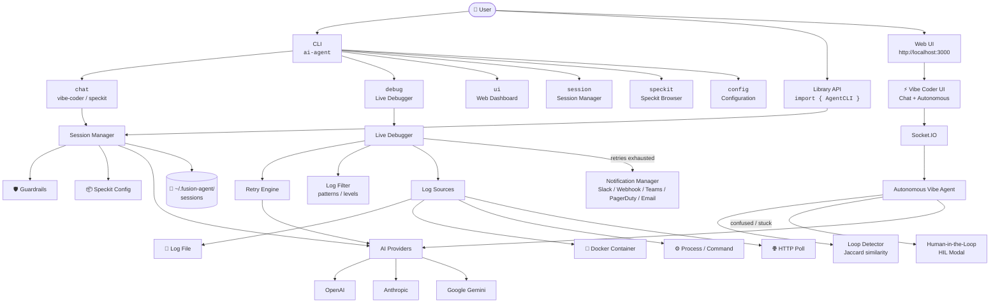
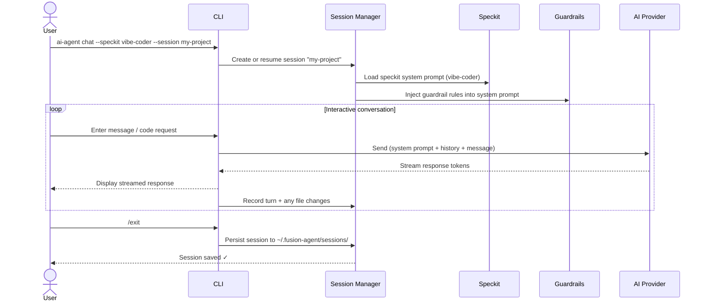
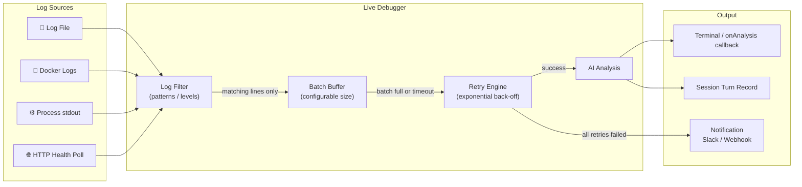
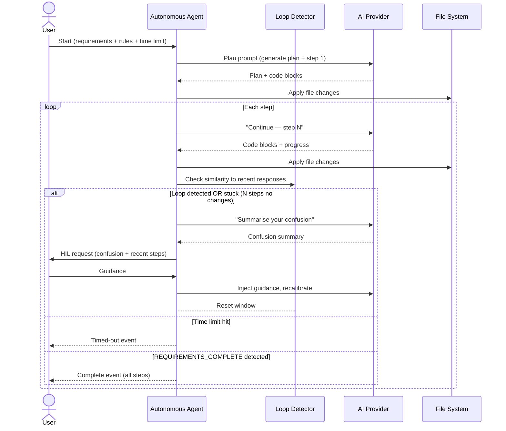

# fusion-agent

> ⚠️ **Package renamed:** The previous npm package `polyai-agent` has been deprecated and replaced by **`fusion-agent`**.  
> Please install the new package: `npm install -g fusion-agent`

An AI-powered **vibe coder**, **live service debugger**, **autonomous agent**, and **session manager** — deployable as a CLI or importable as a TypeScript library.

Supports **OpenAI**, **Anthropic**, and **Google Gemini** with streaming responses.

---

## Features

| Feature | Description |
|---------|-------------|
| 🤖 Vibe Coder | AI pair-programmer that reads your project context, generates, and refactors code |
| ⚡ Vibe Coder — Autonomous Mode | Give it a requirements file and rules; it codes end-to-end until done, with loop-detection and human-in-the-loop (HIL) escalation |
| 🔍 Live Debugger | Attach to running services (log files, Docker, processes, HTTP) and get real-time AI analysis |
| 🔁 Debugger — Retry & Notifications | Configurable AI retry with exponential back-off; notify via Slack / webhook when retries are exhausted |
| 🔎 Debugger — Log Filtering | Restrict analysis to specific log patterns (regex) or log levels (ERROR, WARN, …) |
| 📦 Speckits | 7 prebuilt agent configurations: vibe-coder, debugger, code-review, doc-writer, test-writer, refactor, security-audit |
| 🛡 Guardrails | Per-session rules the AI must follow (allowed paths, denied operations, style rules, custom rules) |
| 💾 Sessions | Named, persistent sessions with full conversation history and file-change tracking |
| 🌐 Web UI | Built-in web dashboard — session viewer, **interactive Vibe Coder chat**, and **Autonomous Mode control panel** |
| 📚 Library API | Importable TypeScript module for programmatic use |

---

## Architecture & Flow

### High-Level Architecture



---

### Chat Session Flow



---

### Live Debugger Flow



---

### Autonomous Vibe Coder Flow



---

## Installation

```bash
# Global install (recommended for CLI use)
npm install -g fusion-agent

# Dev dependency (for programmatic use)
npm install --save-dev fusion-agent
```

---

## Quick Start

### Set your API key

```bash
export OPENAI_API_KEY=sk-...
# or
export ANTHROPIC_API_KEY=sk-ant-...
# or
export GEMINI_API_KEY=AIza...
```

### Start coding

```bash
ai-agent chat
```

### Debug a live service

```bash
ai-agent debug --file /var/log/myapp.log
ai-agent debug --docker my-container
ai-agent debug --cmd "node server.js"
```

### Launch Web UI (includes Vibe Coder)

```bash
ai-agent ui
# Open http://localhost:3000
```

---

## CLI Reference

```
Usage: ai-agent [options] [command]

Commands:
  chat [options]     Start an interactive chat session (vibe coder mode)
  speckit [name]     List or run a prebuilt speckit
  debug [options]    Attach to a live service and start AI-assisted debugging
  session [options]  Manage sessions (list, delete, export)
  ui [options]       Launch the Web UI
  config [options]   Configure default settings

Options:
  -V, --version      output the version number
  -h, --help         display help for command
```

### `ai-agent chat`

```bash
ai-agent chat [options]

Options:
  -p, --provider <provider>  AI provider (openai|anthropic|gemini)
  -m, --model <model>        Model name (e.g. gpt-4o)
  -s, --session <name>       Session name — creates or resumes (default: "default")
  -k, --speckit <speckit>    Speckit to use (default: vibe-coder)
  -g, --guardrail <rule>     Add a guardrail rule (repeatable)
  --context                  Inject project directory structure as context
```

#### Interactive commands

Inside a chat session:

| Command | Action |
|---------|--------|
| `/exit` or `/quit` | End session and save |
| `/save` | Save current session |
| `/turns` | Show conversation history |
| `/context` | Inject current project context |

### `ai-agent speckit`

```bash
ai-agent speckit           # list all speckits
ai-agent speckit vibe-coder  # show details of a speckit
```

### `ai-agent debug`

```bash
ai-agent debug [options]

Connection (one required):
  -f, --file <logFile>       Watch a log file
  -d, --docker <container>   Attach to Docker container logs
  -c, --cmd <command>        Run and attach to a process command

Analysis tuning:
  --batch <n>                Lines to accumulate before analysis (default: 20)
  --log-pattern <patterns>   Comma-separated regex patterns; only matching lines
                             are analysed. Overrides the default error-keyword gate.
  --log-level <levels>       Comma-separated log levels to watch (e.g. ERROR,WARN,FATAL)

Resilience:
  --retry <n>                AI retry attempts on failure (default: 3)
  --retry-delay <ms>         Base retry delay in ms — doubles each attempt (default: 1000)

Notifications (sent when all retries are exhausted):
  --notify-slack <url>       Slack incoming webhook URL
  --notify-webhook <url>     Generic HTTP webhook URL

Other:
  -p, --provider <provider>  AI provider
  -m, --model <model>        Model name
  -s, --session <name>       Session name (default: "debug-session")
```

**Examples:**

```bash
# Watch only ERROR and FATAL lines
ai-agent debug --file app.log --log-level ERROR,FATAL

# Watch lines matching a custom pattern
ai-agent debug --docker my-api --log-pattern "OOM|killed|segfault"

# Retry up to 5 times, then post to Slack
ai-agent debug --file app.log --retry 5 --notify-slack https://hooks.slack.com/...
```

### `ai-agent session`

```bash
ai-agent session --list           # List all sessions
ai-agent session --delete <id>    # Delete a session
ai-agent session --export <id>    # Print session JSON
```

### `ai-agent ui`

```bash
ai-agent ui               # Start on default port 3000
ai-agent ui --port 8080   # Custom port
```

### `ai-agent config`

```bash
ai-agent config --show              # Show current config
ai-agent config --provider openai   # Set default provider
ai-agent config --model gpt-4o      # Set default model
ai-agent config --port 3000         # Set default Web UI port
```

---

## Speckits

Speckits are pre-configured agent personas. Use `--speckit <name>` with `chat`.

| Name | Description |
|------|-------------|
| `vibe-coder` | Full-stack AI pair programmer (default) |
| `debugger` | Root-cause analysis and targeted code fixes |
| `code-review` | OWASP/quality review with severity grading |
| `doc-writer` | JSDoc, README, OpenAPI docs generation |
| `test-writer` | Unit and integration test generation |
| `refactor` | Structural refactoring without changing behavior |
| `security-audit` | OWASP Top 10 security vulnerability scan |

```bash
ai-agent chat --speckit security-audit
```

---

## Guardrails

Guardrails are rules injected into the AI's system prompt to constrain its behavior.

```bash
# Only allow changes in src/
ai-agent chat -g "Only modify files within the src/ directory"

# Enforce code style
ai-agent chat -g "Always use TypeScript strict mode" -g "Prefer async/await over callbacks"

# Multiple guardrails
ai-agent chat \
  -g "Never delete files" \
  -g "Always write unit tests for new functions" \
  -g "Use camelCase for all variable names"
```

### Guardrail types (programmatic API)

```typescript
import { createGuardrail } from 'fusion-agent';

createGuardrail('allow-paths', ['./src', './tests'])
createGuardrail('deny-paths', ['./node_modules', './.env'])
createGuardrail('deny-operations', ['delete', 'overwrite'])
createGuardrail('max-tokens', 2000)
createGuardrail('style', 'Use functional programming patterns')
createGuardrail('custom', 'Always add JSDoc to exported functions')
```

---

## Configuration File

Create `.fusion-agent.json` in your project root:

```json
{
  "provider": "openai",
  "model": "gpt-4o",
  "port": 3000,
  "guardrails": [
    { "type": "custom", "value": "Always use TypeScript" }
  ]
}
```

Or `~/.fusion-agent/config.json` for global settings.

**API keys are never stored in config files** — use environment variables:

```bash
OPENAI_API_KEY=sk-...
ANTHROPIC_API_KEY=sk-ant-...
GEMINI_API_KEY=AIza...
AI_PROVIDER=openai
AI_MODEL=gpt-4o
AI_AGENT_PORT=3000
```

---

## Web UI

Start with `ai-agent ui` and open `http://localhost:3000`.

### Sessions Dashboard

View all sessions, status, provider, model, speckit, and file changes. Click into any session to browse its full conversation history. Export sessions as JSON.

### ⚡ Vibe Coder

The **Vibe Coder** page lets you run the AI pair-programmer directly in the browser. It has two tabs:

#### 💬 Chat Tab

Interactive chat mode identical to the CLI — but in the browser:

1. Enter a session name and (optionally) the path to your project directory on the server.
2. Click **New Session** to connect.
3. Type a prompt and press **Send** (or `Ctrl+Enter`).
4. The AI response streams in real time. Any file blocks in the response (```` ```language:path/to/file ``` ````) are automatically written to disk.
5. Changed files appear in the **Files Changed** panel on the right.
6. Click **📁** to inject the current project directory structure as context.

#### 🤖 Autonomous Tab

Give the agent a requirements file and let it code unattended:

| Setting | Description |
|---------|-------------|
| **Requirements file path** | Server-side path to a `.md` or `.txt` requirements file |
| **Paste requirements** | Alternatively, paste requirements text directly |
| **Rules** | Add one or more constraints the agent must follow (e.g. "Use TypeScript strict mode") |
| **Time limit** | Stop automatically after N seconds (0 = no limit) |
| **Max steps** | Maximum iteration count before forcing a HIL check (default: 50) |

Click **▶ Run Autonomous** to start. The agent will:

1. Read the requirements and generate an implementation plan.
2. Implement each step, writing files to disk.
3. Check its own responses for repetition or lack of progress (loop detection).
4. If stuck or looping — it **asks you for help** via the HIL modal (see below).
5. Stop when it outputs `REQUIREMENTS_COMPLETE` or hits a limit.

#### 🤔 Human-in-the-Loop (HIL) Modal

When the autonomous agent detects it is confused, stuck, or generating repetitive output, it pauses and shows a modal dialog:

- **Why it stopped** — `loop-detected`, `stuck`, `error`, or `max-steps-reached`
- **Confusion summary** — the AI's own explanation of what is blocking it
- **Recent steps** — a quick review of the last few actions
- **Your guidance** — type what the agent should do differently, then click **Continue →**

The agent resumes with your guidance injected into the conversation.

### Settings

Configure the default AI provider and model used by the Web UI.

### Real-time updates

All pages use Socket.IO — streaming tokens, file-change notifications, and status badges update live without page refresh.

---

## Library / Programmatic API

```typescript
import { AgentCLI, createGuardrail } from 'fusion-agent';

// Create an agent instance
const agent = new AgentCLI({
  provider: 'openai',   // or 'anthropic', 'gemini'
  model: 'gpt-4o',
  apiKey: process.env.OPENAI_API_KEY,
});

// One-shot chat
const response = await agent.chat('Write a hello world in Rust');
console.log(response);

// Session-based chat with guardrails
const session = agent.createSession({
  name: 'my-project',
  speckit: 'vibe-coder',
  guardrails: [
    createGuardrail('allow-paths', ['./src']),
    createGuardrail('custom', 'Always add TypeScript types'),
  ],
});

const turn = await session.chat('Add a user authentication middleware');
console.log(turn.assistantMessage);

// Apply a file change
session.applyFileChange('./src/middleware/auth.ts', '// new content...');

// Revert the change
session.revertTurnChanges(turn.id);

// Save session
agent.sessionManager.persistSession(session);
```

### Live Debugger API

```typescript
import { AgentCLI, LiveDebugger } from 'fusion-agent';

const agent = new AgentCLI({ provider: 'openai' });
const session = agent.createSession({ name: 'debug', speckit: 'debugger' });

const debugger_ = new LiveDebugger({
  session,
  batchSize: 20,

  // Resilience
  retryCount: 3,           // retry up to 3 times (default)
  retryDelayMs: 1000,      // 1 s base delay, doubles each attempt

  // Log filtering — omit both to accept all lines (default behaviour)
  logLevels: ['ERROR', 'WARN', 'FATAL'],   // only these levels
  logPatterns: ['OOM', 'killed'],           // OR these patterns

  // Notification when all retries are exhausted
  notifications: {
    slack: { enabled: true, webhookUrl: 'https://hooks.slack.com/...' },
  },

  onLog: (line) => console.log(line),
  onAnalysis: (analysis) => console.log('AI:', analysis),
});

// Listen for errors without crashing
debugger_.on('error', (err) => console.error('Debugger error:', err.message));

// Watch a log file
debugger_.watchLogFile('/var/log/app.log');

// Or connect to a service
debugger_.connectToService({ type: 'docker', container: 'my-app' });
debugger_.connectToService({ type: 'process', command: 'node', args: ['server.js'] });
debugger_.connectToService({ type: 'http-poll', url: 'http://localhost:8080/health' });

// Stop
process.on('SIGINT', () => debugger_.stop());
```

### Autonomous Vibe Coder API

```typescript
import { AgentCLI, AutonomousVibeAgent } from 'fusion-agent';

const agent = new AgentCLI({ provider: 'openai' });
const session = agent.createSession({
  name: 'auto-build',
  speckit: 'vibe-coder',
  projectDir: process.cwd(),
});

const autoAgent = new AutonomousVibeAgent(session, {
  // Supply one of:
  requirementsFile: './requirements.md',   // path on disk
  // requirementsContent: '## Build a REST API\n...',   // or inline text

  rules: [
    { id: 'ts', description: 'All files must be TypeScript' },
    { id: 'tests', description: 'Every module must have a matching .test.ts file' },
  ],

  timeLimitSeconds: 600,   // stop after 10 minutes (0 = no limit)
  maxSteps: 50,            // stop after 50 steps

  // Loop / stuck detection
  loopWindowSize: 4,              // compare against last 4 responses
  loopSimilarityThreshold: 0.85,  // 85 % word-level Jaccard similarity = loop
  stuckThreshold: 3,              // 3 consecutive steps with no file changes = stuck
});

autoAgent.on('status', (s) => console.log('Status:', s));
autoAgent.on('step', (step) => console.log(`Step ${step.stepNumber} — changed:`, step.filesChanged));
autoAgent.on('file-changed', (path) => console.log('Written:', path));
autoAgent.on('chunk', (chunk) => process.stdout.write(chunk));

// Handle human-in-the-loop requests
autoAgent.on('hil-request', (req) => {
  console.log('\n⚠ Agent is confused:', req.confusionSummary);
  // Provide guidance — in a real app this could open a UI prompt
  autoAgent.receiveHILResponse('Focus only on the authentication module for now.');
});

autoAgent.on('complete', (steps) => {
  console.log(`Done! ${steps.length} steps completed.`);
  agent.sessionManager.persistSession(session);
});

autoAgent.on('error', (err) => console.error('Agent error:', err.message));

await autoAgent.run();

// Or stop it early:
// autoAgent.stop();
```

### Web Server API

```typescript
import { AgentCLI, createWebServer } from 'fusion-agent';

const agent = new AgentCLI({ provider: 'openai' });
const server = createWebServer({
  port: 3000,
  sessionManager: agent.sessionManager,
  apiKey: process.env.OPENAI_API_KEY,
  provider: 'openai',
  model: 'gpt-4o',
  projectDir: process.cwd(),  // default project dir for new vibe-coder sessions
});
await server.start();
```

---

## Providers & Models

| Provider | Env Variable | Recommended Models |
|----------|-------------|-------------------|
| OpenAI | `OPENAI_API_KEY` | `gpt-4o`, `gpt-4o-mini`, `gpt-4-turbo` |
| Anthropic | `ANTHROPIC_API_KEY` | `claude-3-5-sonnet-20241022`, `claude-3-5-haiku-20241022` |
| Google Gemini | `GEMINI_API_KEY` | `gemini-1.5-pro`, `gemini-1.5-flash` |

---

## Live Debugger — Error Handling & Resilience

The live debugger is designed to never crash your process:

| Scenario | Behaviour |
|----------|-----------|
| AI provider call fails | Retried with exponential back-off (configurable `retryCount` / `retryDelayMs`) |
| All retries exhausted | `'error'` event emitted; notification sent if `notifications` is configured |
| Log file not found | `'error'` event emitted; no exception thrown |
| Log file I/O error | `'error'` event emitted |
| Spawned process fails to start | `'error'` event emitted on the connector; forwarded as `'error'` on the debugger |
| Child process `'exit'` after `'error'` | Deduplicated — only one event fires per lifecycle |
| Log listener throws | Caught internally; logged; does not propagate |

Always attach an `'error'` listener to prevent Node.js unhandled-error crashes:

```typescript
debugger_.on('error', (err) => {
  console.error('Debugger error:', err.message);
  // handle gracefully — the debugger keeps running
});
```

---

## Development

```bash
git clone https://github.com/fury-r/fusion-agent.git
cd fusion-agent
npm install
npm run build
npm test
npm run dev -- chat   # run CLI in dev mode
```

---

## License

MIT


