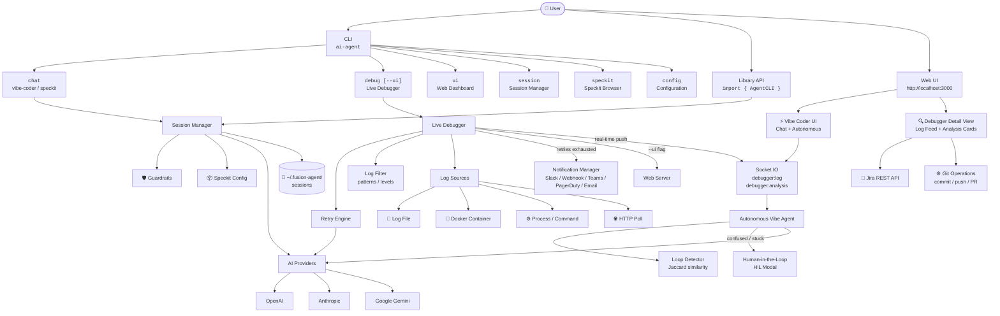
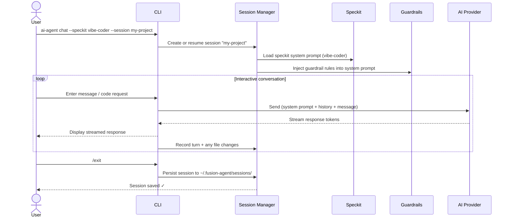
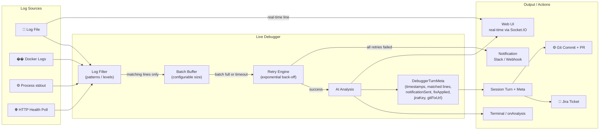
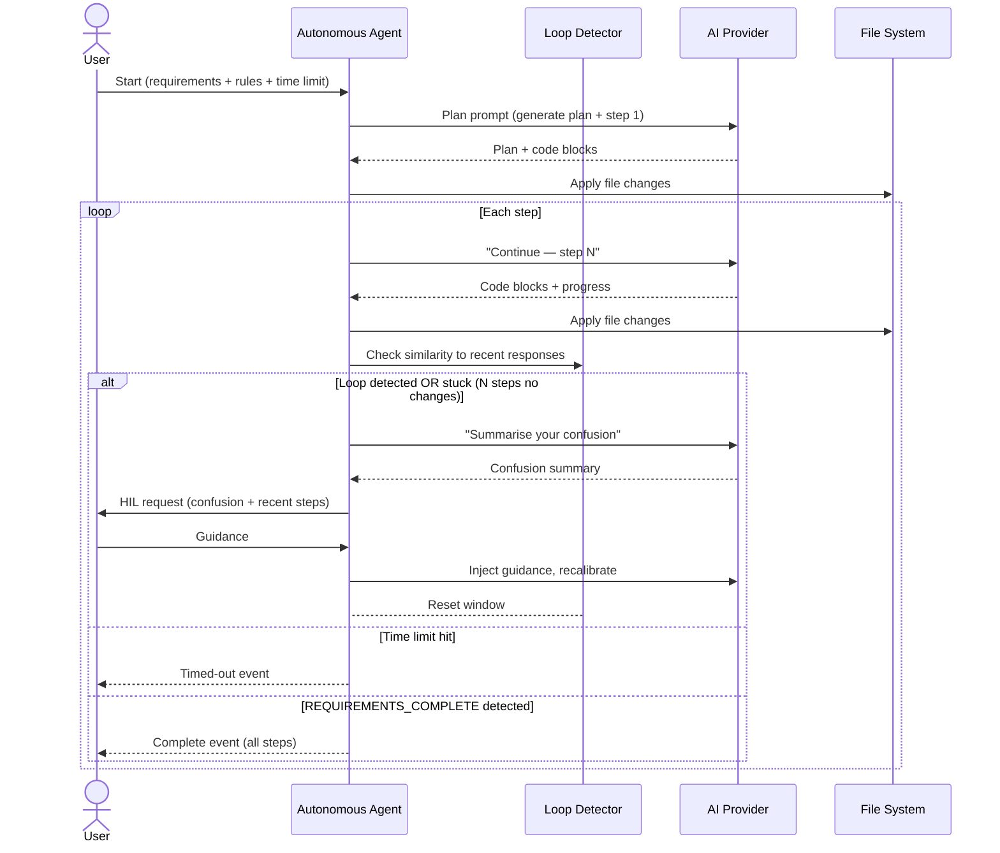

# fusion-agent

> ⚠️ **Package renamed:** The previous npm package `polyai-agent` has been deprecated and replaced by **`fusion-agent`**.  
> Please install the new package: `npm install -g fusion-agent`

An AI-powered **vibe coder**, **live service debugger**, **autonomous agent**, and **session manager** — deployable as a CLI or importable as a TypeScript library.

Supports **OpenAI**, **Anthropic**, and **Google Gemini** with streaming responses.

---

## Features

| Feature | Description |
|---------|-------------|
| 🤖 Vibe Coder | AI pair-programmer that reads your project context, generates, and refactors code |
| ⚡ Vibe Coder — Autonomous Mode | Give it a requirements file and rules; it codes end-to-end until done, with loop-detection and human-in-the-loop (HIL) escalation |
| 🔍 Live Debugger | Attach to running services (log files, Docker, processes, HTTP) and get real-time AI analysis |
| 🌐 Live Debugger + Web UI | Run `--ui` alongside the debugger to see a live dashboard with log feeds, AI analysis cards, and action buttons |
| 🔁 Debugger — Retry & Notifications | Configurable AI retry with exponential back-off; notify via Slack / webhook when retries are exhausted |
| 🔎 Debugger — Log Filtering | Restrict analysis to specific log patterns (regex) or log levels (ERROR, WARN, …) |
| 🎫 Jira Integration | Create Jira tickets directly from Live Debugger analysis events, with per-integration guardrails |
| ⚙ Git Integration | Apply AI-proposed code fixes to a git repository, push, and open a pull request, with per-integration guardrails |
| 📦 Speckits | 7 prebuilt agent configurations: vibe-coder, debugger, code-review, doc-writer, test-writer, refactor, security-audit |
| 🛡 Guardrails | Per-session rules the AI must follow (allowed paths, denied operations, style rules, custom rules) |
| 💾 Sessions | Named, persistent sessions with full conversation history, file-change tracking, and rich debugger metadata |
| 🌐 Web UI | Built-in web dashboard — session viewer, **interactive Vibe Coder chat**, **Autonomous Mode control panel**, and **Live Debugger detail view** |
| 📚 Library API | Importable TypeScript module for programmatic use |

---

## Architecture & Flow

### High-Level Architecture



---

### Chat Session Flow



---

### Live Debugger Flow (with `--ui`)



---

### Autonomous Vibe Coder Flow



---

## Installation

```bash
# Global install (recommended for CLI use)
npm install -g fusion-agent

# Dev dependency (for programmatic use)
npm install --save-dev fusion-agent
```

---

## Quick Start

### Set your API key

```bash
export OPENAI_API_KEY=sk-...
# or
export ANTHROPIC_API_KEY=sk-ant-...
# or
export GEMINI_API_KEY=AIza...
```

### Start coding

```bash
ai-agent chat
```

### Debug a live service

```bash
# Basic — terminal output only
ai-agent debug --file /var/log/myapp.log

# With Web UI dashboard alongside the debugger
ai-agent debug --file /var/log/myapp.log --ui

# Watch only ERROR/FATAL lines, with custom session name
ai-agent debug --docker my-container --log-level ERROR,FATAL --session live-debugger-prod --ui
```

### Launch Web UI (includes Vibe Coder + Debugger sessions)

```bash
ai-agent ui
# Open http://localhost:3000
```

---

## CLI Reference

```
Usage: ai-agent [options] [command]

Commands:
  chat [options]     Start an interactive chat session (vibe coder mode)
  speckit [name]     List or run a prebuilt speckit
  debug [options]    Attach to a live service and start AI-assisted debugging
  session [options]  Manage sessions (list, delete, export)
  ui [options]       Launch the Web UI
  config [options]   Configure default settings

Options:
  -V, --version      output the version number
  -h, --help         display help for command
```

### `ai-agent chat`

```bash
ai-agent chat [options]

Options:
  -p, --provider <provider>  AI provider (openai|anthropic|gemini)
  -m, --model <model>        Model name (e.g. gpt-4o)
  -s, --session <name>       Session name — creates or resumes (default: "default")
  -k, --speckit <speckit>    Speckit to use (default: vibe-coder)
  -g, --guardrail <rule>     Add a guardrail rule (repeatable)
  --context                  Inject project directory structure as context
```

#### Interactive commands

Inside a chat session:

| Command | Action |
|---------|--------|
| `/exit` or `/quit` | End session and save |
| `/save` | Save current session |
| `/turns` | Show conversation history |
| `/context` | Inject current project context |

### `ai-agent speckit`

```bash
ai-agent speckit           # list all speckits
ai-agent speckit vibe-coder  # show details of a speckit
```

### `ai-agent debug`

```bash
ai-agent debug [options]

Connection (one required):
  -f, --file <logFile>       Watch a log file
  -d, --docker <container>   Attach to Docker container logs
  -c, --cmd <command>        Run and attach to a process command

Session:
  -s, --session <name>       Session name (default: live-debugger-<id>)
                             Appears in the Sessions tab with a 🔍 prefix

Web UI:
  --ui                       Launch the Web UI alongside the debugger.
                             The debugger session is immediately visible in the
                             Sessions tab with a live log feed and AI analysis cards.
  --port <port>              Web UI port when --ui is used (default: 3000)

Analysis tuning:
  --batch <n>                Lines to accumulate before analysis (default: 20)
  --log-pattern <patterns>   Comma-separated regex patterns; only matching lines
                             are analysed. Overrides the default error-keyword gate.
  --log-level <levels>       Comma-separated log levels to watch (e.g. ERROR,WARN,FATAL)

Resilience:
  --retry <n>                AI retry attempts on failure (default: 3)
  --retry-delay <ms>         Base retry delay in ms — doubles each attempt (default: 1000)

Notifications (sent when all retries are exhausted):
  --notify-slack <url>       Slack incoming webhook URL
  --notify-teams <url>       Microsoft Teams webhook URL
  --notify-webhook <url>     Generic HTTP webhook URL

Other:
  -p, --provider <provider>  AI provider
  -m, --model <model>        Model name
```

**Examples:**

```bash
# Watch only ERROR and FATAL lines
ai-agent debug --file app.log --log-level ERROR,FATAL

# Watch lines matching a custom pattern and open the Web UI
ai-agent debug --docker my-api --log-pattern "OOM|killed|segfault" --ui

# Retry up to 5 times, then post to Slack, with a custom session name
ai-agent debug --file app.log --retry 5 --notify-slack https://hooks.slack.com/... \
  --session live-debugger-prod --ui --port 4000
```

### `ai-agent session`

```bash
ai-agent session --list           # List all sessions
ai-agent session --delete <id>    # Delete a session
ai-agent session --export <id>    # Print session JSON
```

### `ai-agent ui`

```bash
ai-agent ui               # Start on default port 3000
ai-agent ui --port 8080   # Custom port
```

### `ai-agent config`

```bash
ai-agent config --show              # Show current config
ai-agent config --provider openai   # Set default provider
ai-agent config --model gpt-4o      # Set default model
ai-agent config --port 3000         # Set default Web UI port
```

---

## Speckits

Speckits are pre-configured agent personas. Use `--speckit <name>` with `chat`.

| Name | Description |
|------|-------------|
| `vibe-coder` | Full-stack AI pair programmer (default) |
| `debugger` | Root-cause analysis and targeted code fixes |
| `code-review` | OWASP/quality review with severity grading |
| `doc-writer` | JSDoc, README, OpenAPI docs generation |
| `test-writer` | Unit and integration test generation |
| `refactor` | Structural refactoring without changing behavior |
| `security-audit` | OWASP Top 10 security vulnerability scan |

```bash
ai-agent chat --speckit security-audit
```

---

## Guardrails

Guardrails are rules injected into the AI's system prompt to constrain its behavior.

```bash
# Only allow changes in src/
ai-agent chat -g "Only modify files within the src/ directory"

# Enforce code style
ai-agent chat -g "Always use TypeScript strict mode" -g "Prefer async/await over callbacks"

# Multiple guardrails
ai-agent chat \
  -g "Never delete files" \
  -g "Always write unit tests for new functions" \
  -g "Use camelCase for all variable names"
```

### Guardrail types (programmatic API)

```typescript
import { createGuardrail } from 'fusion-agent';

createGuardrail('allow-paths', ['./src', './tests'])
createGuardrail('deny-paths', ['./node_modules', './.env'])
createGuardrail('deny-operations', ['delete', 'overwrite'])
createGuardrail('max-tokens', 2000)
createGuardrail('style', 'Use functional programming patterns')
createGuardrail('custom', 'Always add JSDoc to exported functions')
```

### Jira integration guardrails

Jira-specific guardrails are passed in `jiraConfig.guardrails` and operate on ticket content — they never reach the AI. Supported formats:

| Rule | Example | Effect |
|------|---------|--------|
| `deny-keyword:<word>` | `deny-keyword:secret` | Blocks tickets whose summary or description contains the word |
| `require-label:<label>` | `require-label:live-debugger` | Ticket creation fails unless this label is present |
| `max-summary-length:<n>` | `max-summary-length:100` | Ticket creation fails if summary exceeds N characters |

### Git integration guardrails

Git-specific guardrails are passed in `gitConfig.guardrails` and operate on the set of files being committed — the AI never directly touches the repo. Supported formats:

| Rule | Example | Effect |
|------|---------|--------|
| `allow-path:<prefix>` | `allow-path:src/` | Only files under this prefix may be modified |
| `deny-path:<prefix>` | `deny-path:secrets/` | Files under this prefix are blocked from modification |
| `max-files:<n>` | `max-files:5` | Commit is rejected if it touches more than N files |

---

## Configuration File

Create `.fusion-agent.json` in your project root:

```json
{
  "provider": "openai",
  "model": "gpt-4o",
  "port": 3000,
  "guardrails": [
    { "type": "custom", "value": "Always use TypeScript" }
  ]
}
```

Or `~/.fusion-agent/config.json` for global settings.

**API keys are never stored in config files** — use environment variables:

```bash
OPENAI_API_KEY=sk-...
ANTHROPIC_API_KEY=sk-ant-...
GEMINI_API_KEY=AIza...
AI_PROVIDER=openai
AI_MODEL=gpt-4o
AI_AGENT_PORT=3000
```

---

## Web UI

Start with `ai-agent ui` and open `http://localhost:3000`.

### Sessions Dashboard

View all sessions, status, provider, model, speckit, and file changes. Sessions created by the Live Debugger appear with a **🔍 prefix** (e.g. `🔍 live-debugger-k3x9p` or `🔍 live-debugger-prod`). Click any session to view its detail page.

### 🔍 Debugger Session Detail View

When you click on a debugger session (one with `speckit: 'debugger'`), you see a dedicated three-panel view:

#### Log Feed (left panel)

- Every log line that matched the configured filter is shown here with a timestamp chip.
- Matched lines (those that triggered an AI analysis) are highlighted in yellow.
- When **Subscribe Live** is active, new lines stream in from the running debugger in real time via Socket.IO.

#### AI Analysis Cards (middle panel)

Each batch of matched log lines that was sent to the AI produces one card:

| Card element | Description |
|---|---|
| **Analysis #N** + timestamps | Sequential number, prompt-sent time, response-received time, and duration in ms |
| **Prompt sent** (collapsed) | Click to expand and see the exact prompt that was sent to the AI |
| **AI response** | Full analysis with code-block rendering (same as Vibe Coder) |
| 🔔 **Notified** badge | Shown if a Slack/webhook notification was dispatched for this event |
| 🔧 **Fix applied** badge | Shown if a git fix was committed for this analysis |
| **Jira key chip** | e.g. `OPS-123` — shown after a ticket is created |
| **Git fix chip** | PR URL or commit SHA — shown after a git fix is applied |
| **🎫 Create Jira Ticket** | Opens the Jira modal to file a ticket from this analysis |
| **⚙ Apply Git Fix** | Opens the Git modal to commit AI-proposed code changes |

#### Info Panel (right panel)

Session metadata: ID, provider, model, speckit, created/updated times, configured guardrails.

#### Subscribe Live button

Click **Subscribe Live** to join the real-time Socket.IO room for this debugger session. The button changes to **● Live** with a green pulsing dot. All subsequent `debugger:log` and `debugger:analysis` events from the running debugger process appear instantly without a page refresh.

#### 🎫 Jira Modal

Fill in your Jira credentials once per session (not stored permanently):

| Field | Description |
|---|---|
| Jira Base URL | e.g. `https://yourorg.atlassian.net` |
| Email | Your Atlassian account email |
| API Token | Generated at [id.atlassian.com](https://id.atlassian.com/manage-profile/security/api-tokens) |
| Project Key | e.g. `OPS`, `INFRA` |
| Issue Type | Default: `Bug` |
| Summary | Pre-populated from the AI analysis; editable |
| Priority | Highest / High / Medium / Low / Lowest |
| Labels | Comma-separated labels |
| Guardrails | One rule per line (e.g. `deny-keyword:classified`) |

Click **Create Ticket** — the ticket is created via `POST /api/debugger/:sessionId/jira` and the Jira key (e.g. `OPS-123`) immediately appears on the analysis card.

#### ⚙ Git Modal

| Field | Description |
|---|---|
| Repo Path | Absolute path to a local git repository (must already exist) |
| Token | GitHub / GitLab personal access token for HTTPS pushes (optional if SSH) |
| Remote URL | e.g. `https://github.com/org/repo` — overrides the existing `origin` remote |
| Branch | Target branch (default: `fusion-agent/auto-fix`) — created if it does not exist |
| GitHub API URL | e.g. `https://api.github.com` — required to open a pull request |
| Commit Message | Defaults to `fix: apply AI-suggested fix from live debugger` |
| PR Title | If set and GitHub API URL is provided, a pull request is opened after push |
| Base Branch | PR base (default: `main`) |
| Guardrails | One rule per line (e.g. `allow-path:src/`, `deny-path:secrets/`) |

Click **Apply Fix** — the AI-proposed code blocks are extracted from the analysis, written to disk, committed, and optionally pushed + PRed via `POST /api/debugger/:sessionId/git-fix`. The resulting PR URL or commit SHA appears on the analysis card.

### ⚡ Vibe Coder

The **Vibe Coder** page lets you run the AI pair-programmer directly in the browser. It has two tabs:

#### 💬 Chat Tab

Interactive chat mode identical to the CLI — but in the browser:

1. Enter a session name and (optionally) the path to your project directory on the server.
2. Click **New Session** to connect.
3. Type a prompt and press **Send** (or `Ctrl+Enter`).
4. The AI response streams in real time. Any file blocks in the response (```` ```language:path/to/file ``` ````) are automatically written to disk.
5. Changed files appear in the **Files Changed** panel on the right.
6. Click **📁** to inject the current project directory structure as context.

#### 🤖 Autonomous Tab

Give the agent a requirements file and let it code unattended:

| Setting | Description |
|---------|-------------|
| **Requirements file path** | Server-side path to a `.md` or `.txt` requirements file |
| **Paste requirements** | Alternatively, paste requirements text directly |
| **Rules** | Add one or more constraints the agent must follow (e.g. "Use TypeScript strict mode") |
| **Time limit** | Stop automatically after N seconds (0 = no limit) |
| **Max steps** | Maximum iteration count before forcing a HIL check (default: 50) |

Click **▶ Run Autonomous** to start. The agent will:

1. Read the requirements and generate an implementation plan.
2. Implement each step, writing files to disk.
3. Check its own responses for repetition or lack of progress (loop detection).
4. If stuck or looping — it **asks you for help** via the HIL modal (see below).
5. Stop when it outputs `REQUIREMENTS_COMPLETE` or hits a limit.

#### 🤔 Human-in-the-Loop (HIL) Modal

When the autonomous agent detects it is confused, stuck, or generating repetitive output, it pauses and shows a modal dialog:

- **Why it stopped** — `loop-detected`, `stuck`, `error`, or `max-steps-reached`
- **Confusion summary** — the AI's own explanation of what is blocking it
- **Recent steps** — a quick review of the last few actions
- **Your guidance** — type what the agent should do differently, then click **Continue →**

The agent resumes with your guidance injected into the conversation.

### Settings

Configure the default AI provider and model used by the Web UI.

### Real-time updates

All pages use Socket.IO — streaming tokens, file-change notifications, live log lines, and AI analysis cards update in real time without page refresh.

---

## Library / Programmatic API

```typescript
import { AgentCLI, createGuardrail } from 'fusion-agent';

// Create an agent instance
const agent = new AgentCLI({
  provider: 'openai',   // or 'anthropic', 'gemini'
  model: 'gpt-4o',
  apiKey: process.env.OPENAI_API_KEY,
});

// One-shot chat
const response = await agent.chat('Write a hello world in Rust');
console.log(response);

// Session-based chat with guardrails
const session = agent.createSession({
  name: 'my-project',
  speckit: 'vibe-coder',
  guardrails: [
    createGuardrail('allow-paths', ['./src']),
    createGuardrail('custom', 'Always add TypeScript types'),
  ],
});

const turn = await session.chat('Add a user authentication middleware');
console.log(turn.assistantMessage);

// Apply a file change
session.applyFileChange('./src/middleware/auth.ts', '// new content...');

// Revert the change
session.revertTurnChanges(turn.id);

// Save session
agent.sessionManager.persistSession(session);
```

### Live Debugger API

```typescript
import { AgentCLI, LiveDebugger } from 'fusion-agent';

const agent = new AgentCLI({ provider: 'openai' });
const session = agent.createSession({ name: 'live-debugger-prod', speckit: 'debugger' });

const debugger_ = new LiveDebugger({
  session,
  batchSize: 20,

  // Resilience
  retryCount: 3,           // retry up to 3 times (default)
  retryDelayMs: 1000,      // 1 s base delay, doubles each attempt

  // Log filtering — omit both to accept all lines (default behaviour)
  logLevels: ['ERROR', 'WARN', 'FATAL'],   // only these levels
  logPatterns: ['OOM', 'killed'],           // OR these patterns

  // Notification when all retries are exhausted
  notifications: {
    slack: { enabled: true, webhookUrl: 'https://hooks.slack.com/...' },
  },

  // Optional: Socket.IO instance for real-time Web UI pushes
  // io: webServer.io,

  onLog: (line) => console.log(line),
  onAnalysis: (analysis, meta) => {
    console.log('AI:', analysis);
    // meta: { matchedLogLines, promptSentAt, responseReceivedAt,
    //         notificationSent, fixApplied, jiraKey?, gitFixUrl? }
    console.log('Prompt sent at:', meta.promptSentAt);
    console.log('Response received at:', meta.responseReceivedAt);
  },
});

// Listen for errors without crashing
debugger_.on('error', (err) => console.error('Debugger error:', err.message));

// Watch a log file
debugger_.watchLogFile('/var/log/app.log');

// Or connect to a service
debugger_.connectToService({ type: 'docker', container: 'my-app' });
debugger_.connectToService({ type: 'process', command: 'node', args: ['server.js'] });
debugger_.connectToService({ type: 'http-poll', url: 'http://localhost:8080/health' });

// Stop
process.on('SIGINT', () => debugger_.stop());
```

### Live Debugger + Web UI (programmatic)

```typescript
import { AgentCLI, LiveDebugger, createWebServer } from 'fusion-agent';

const agent = new AgentCLI({ provider: 'openai' });
const session = agent.createSession({ name: 'live-debugger-prod', speckit: 'debugger' });

// Start the web server first so we can pass its Socket.IO instance
const server = createWebServer({
  port: 3000,
  sessionManager: agent.sessionManager,
  apiKey: process.env.OPENAI_API_KEY,
  provider: 'openai',
});
await server.start();

const debugger_ = new LiveDebugger({
  session,
  io: server.io,   // ← wire up for real-time Web UI pushes
  onAnalysis: (analysis) => agent.sessionManager.persistSession(session),
});

debugger_.on('error', (err) => console.error(err.message));
debugger_.watchLogFile('/var/log/app.log');
```

The debugger session appears immediately in the Web UI Sessions tab (prefixed with 🔍). Open the session detail page and click **Subscribe Live** to watch logs and AI analysis cards update in real time.

### Jira Integration API

```typescript
import { JiraClient } from 'fusion-agent';

const jira = new JiraClient({
  baseUrl: 'https://yourorg.atlassian.net',
  email: 'ops@yourorg.com',
  apiToken: process.env.JIRA_TOKEN!,
  projectKey: 'OPS',
  issueType: 'Bug',            // default
  labels: ['live-debugger'],   // applied to every issue
  guardrails: [
    'deny-keyword:classified',   // block tickets containing "classified"
    'require-label:live-debugger',
    'max-summary-length:200',
  ],
});

// Create an issue from a debugger analysis
const result = await jira.createIssue({
  summary: '[Live Debugger] OOM killer triggered on api-server',
  description: '**Matched log lines:**\n...\n\n**AI Analysis:**\n...',
  priority: 'High',
  labels: ['production'],
});
console.log(`Created: ${result.key} — ${result.url}`);  // e.g. OPS-42

// Add a follow-up comment
await jira.addComment(result.key, 'Fix applied via git — see PR #142');
```

#### Jira guardrail reference

| Rule | Example | Effect |
|------|---------|--------|
| `deny-keyword:<word>` | `deny-keyword:secret` | Blocks ticket creation if summary or description contains the word |
| `require-label:<label>` | `require-label:live-debugger` | Fails if the label is not in the issue's label set |
| `max-summary-length:<n>` | `max-summary-length:200` | Fails if summary exceeds N characters |

### Git Integration API

```typescript
import { GitPatchApplier } from 'fusion-agent';

const patcher = new GitPatchApplier({
  repoPath: '/home/ubuntu/my-service',   // must be an existing git repo
  token: process.env.GITHUB_TOKEN,       // for HTTPS push auth
  remoteUrl: 'https://github.com/org/my-service',
  branch: 'fusion-agent/fix-oom-killer', // created if it does not exist
  apiBaseUrl: 'https://api.github.com',  // enables PR creation
  authorName: 'fusion-agent[bot]',
  authorEmail: 'fusion-agent@noreply',
  guardrails: [
    'allow-path:src/',          // only modify files under src/
    'deny-path:src/secrets/',   // never touch secret files
    'max-files:10',             // at most 10 files per commit
  ],
});

// Apply AI-proposed code blocks and open a pull request
const result = await patcher.applyAndCommit({
  files: {
    'src/server.ts': '// patched content from AI analysis\n...',
    'src/config.ts': '// updated memory limits\n...',
  },
  commitMessage: 'fix: raise memory limit to prevent OOM killer',
  pullRequestTitle: 'fix: raise memory limit (AI-suggested fix)',
  pullRequestBody: 'Auto-generated by fusion-agent Live Debugger.\n\nAnalysis: ...',
  baseBranch: 'main',
});

console.log('Branch:', result.branch);
console.log('Commit:', result.commitSha);
console.log('PR:', result.pullRequestUrl);  // https://github.com/org/repo/pull/43
```

#### Git guardrail reference

| Rule | Example | Effect |
|------|---------|--------|
| `allow-path:<prefix>` | `allow-path:src/` | Only files whose relative path starts with this prefix may be modified |
| `deny-path:<prefix>` | `deny-path:secrets/` | Files under this prefix are always blocked |
| `max-files:<n>` | `max-files:10` | Commit is rejected when it touches more than N files |

### Autonomous Vibe Coder API

```typescript
import { AgentCLI, AutonomousVibeAgent } from 'fusion-agent';

const agent = new AgentCLI({ provider: 'openai' });
const session = agent.createSession({
  name: 'auto-build',
  speckit: 'vibe-coder',
  projectDir: process.cwd(),
});

const autoAgent = new AutonomousVibeAgent(session, {
  // Supply one of:
  requirementsFile: './requirements.md',   // path on disk
  // requirementsContent: '## Build a REST API\n...',   // or inline text

  rules: [
    { id: 'ts', description: 'All files must be TypeScript' },
    { id: 'tests', description: 'Every module must have a matching .test.ts file' },
  ],

  timeLimitSeconds: 600,   // stop after 10 minutes (0 = no limit)
  maxSteps: 50,            // stop after 50 steps

  // Loop / stuck detection
  loopWindowSize: 4,              // compare against last 4 responses
  loopSimilarityThreshold: 0.85,  // 85 % word-level Jaccard similarity = loop
  stuckThreshold: 3,              // 3 consecutive steps with no file changes = stuck
});

autoAgent.on('status', (s) => console.log('Status:', s));
autoAgent.on('step', (step) => console.log(`Step ${step.stepNumber} — changed:`, step.filesChanged));
autoAgent.on('file-changed', (path) => console.log('Written:', path));
autoAgent.on('chunk', (chunk) => process.stdout.write(chunk));

// Handle human-in-the-loop requests
autoAgent.on('hil-request', (req) => {
  console.log('\n⚠ Agent is confused:', req.confusionSummary);
  autoAgent.receiveHILResponse('Focus only on the authentication module for now.');
});

autoAgent.on('complete', (steps) => {
  console.log(`Done! ${steps.length} steps completed.`);
  agent.sessionManager.persistSession(session);
});

autoAgent.on('error', (err) => console.error('Agent error:', err.message));

await autoAgent.run();
```

### Web Server API

```typescript
import { AgentCLI, createWebServer } from 'fusion-agent';

const agent = new AgentCLI({ provider: 'openai' });
const server = createWebServer({
  port: 3000,
  sessionManager: agent.sessionManager,
  apiKey: process.env.OPENAI_API_KEY,
  provider: 'openai',
  model: 'gpt-4o',
  projectDir: process.cwd(),  // default project dir for new vibe-coder sessions
});
await server.start();
// server.io is a Socket.IO Server instance — pass to LiveDebugger for real-time pushes
```

---

## REST API Reference (Web UI Backend)

When the web server is running these endpoints are available in addition to the UI:

| Method | Path | Description |
|--------|------|-------------|
| `GET` | `/api/sessions` | List all sessions |
| `GET` | `/api/sessions/:id` | Get full session detail (including turns + debuggerMeta) |
| `DELETE` | `/api/sessions/:id` | Delete a session |
| `GET` | `/api/sessions/:id/export` | Download session as JSON |
| `POST` | `/api/debugger/:sessionId/jira` | Create a Jira ticket from a debugger turn |
| `POST` | `/api/debugger/:sessionId/git-fix` | Apply AI code fixes from a debugger turn to a git repo |
| `GET` | `/api/settings` | Get current settings |
| `POST` | `/api/settings` | Update settings |

### `POST /api/debugger/:sessionId/jira`

```json
{
  "jiraConfig": {
    "baseUrl": "https://yourorg.atlassian.net",
    "email": "you@yourorg.com",
    "apiToken": "...",
    "projectKey": "OPS",
    "issueType": "Bug",
    "labels": ["live-debugger"],
    "guardrails": ["deny-keyword:classified", "max-summary-length:200"]
  },
  "turnId": "optional — defaults to latest turn",
  "summary": "optional — defaults to first 120 chars of AI analysis",
  "priority": "High",
  "labels": ["production"]
}
```

Response:
```json
{ "id": "10042", "key": "OPS-42", "url": "https://yourorg.atlassian.net/browse/OPS-42" }
```

### `POST /api/debugger/:sessionId/git-fix`

```json
{
  "gitConfig": {
    "repoPath": "/path/to/local/repo",
    "token": "ghp_...",
    "remoteUrl": "https://github.com/org/repo",
    "branch": "fusion-agent/fix-oom",
    "apiBaseUrl": "https://api.github.com",
    "guardrails": ["allow-path:src/", "max-files:5"]
  },
  "turnId": "optional — defaults to latest turn",
  "commitMessage": "fix: apply AI-suggested fix",
  "prTitle": "fix: apply AI-suggested fix for OOM killer",
  "prBody": "Auto-generated by fusion-agent Live Debugger.",
  "baseBranch": "main"
}
```

Response:
```json
{
  "branch": "fusion-agent/fix-oom",
  "commitSha": "a1b2c3d4...",
  "pullRequestUrl": "https://github.com/org/repo/pull/43"
}
```

---

## Providers & Models

| Provider | Env Variable | Recommended Models |
|----------|-------------|-------------------|
| OpenAI | `OPENAI_API_KEY` | `gpt-4o`, `gpt-4o-mini`, `gpt-4-turbo` |
| Anthropic | `ANTHROPIC_API_KEY` | `claude-3-5-sonnet-20241022`, `claude-3-5-haiku-20241022` |
| Google Gemini | `GEMINI_API_KEY` | `gemini-1.5-pro`, `gemini-1.5-flash` |

---

## Live Debugger — Error Handling & Resilience

The live debugger is designed to never crash your process:

| Scenario | Behaviour |
|----------|-----------|
| AI provider call fails | Retried with exponential back-off (configurable `retryCount` / `retryDelayMs`) |
| All retries exhausted | `'error'` event emitted; notification sent if `notifications` is configured |
| Log file not found | `'error'` event emitted; no exception thrown |
| Log file I/O error | `'error'` event emitted |
| Spawned process fails to start | `'error'` event emitted on the connector; forwarded as `'error'` on the debugger |
| Child process `'exit'` after `'error'` | Deduplicated — only one event fires per lifecycle |
| Log listener throws | Caught internally; logged; does not propagate |
| Web UI not connected | Socket.IO `io.to(room).emit(...)` is a no-op — no crash |

Always attach an `'error'` listener to prevent Node.js unhandled-error crashes:

```typescript
debugger_.on('error', (err) => {
  console.error('Debugger error:', err.message);
  // handle gracefully — the debugger keeps running
});
```

---

## Development

```bash
git clone https://github.com/fury-r/fusion-agent.git
cd fusion-agent
npm install
npm run build
npm test
npm run dev -- chat   # run CLI in dev mode
```

---

## License

MIT
