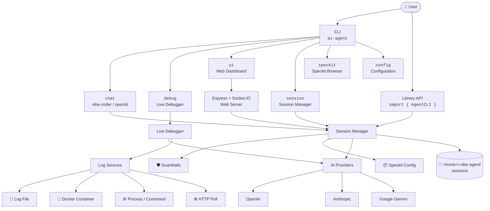
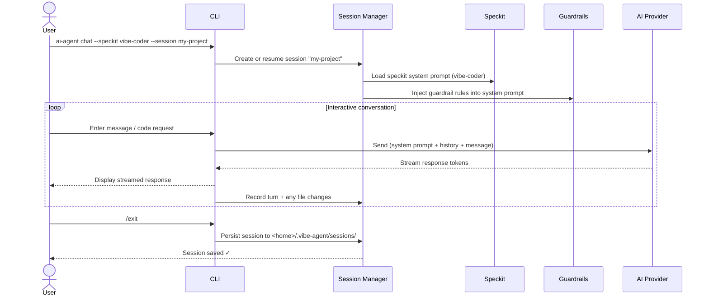
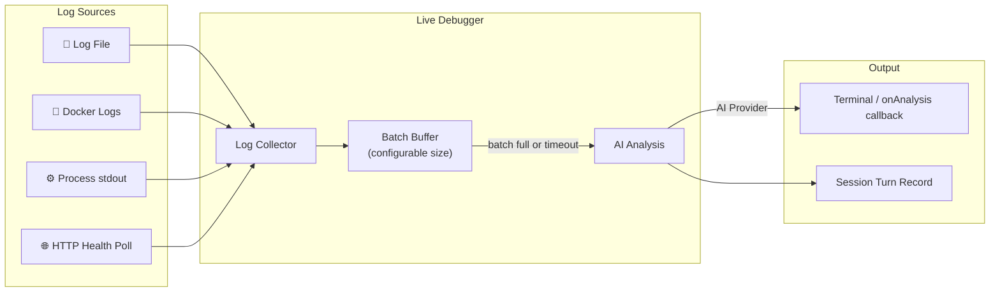

# vibe-agent

> ⚠️ **Package renamed:** The previous npm package `polyai-agent` has been deprecated and replaced by **`vibe-agent`**.  
> Please install the new package: `npm install -g vibe-agent`

An AI-powered **vibe coder**, **live service debugger**, and **agent session manager** deployable, usable as a CLI or importable library.

Supports **OpenAI**, **Anthropic**, and **Google Gemini** with streaming responses.

---

## Features

| Feature | Description |
|---------|-------------|
| 🤖 Vibe Coder | AI pair-programmer that reads your project context and generates/refactors code |
| 🔍 Live Debugger | Attach to running services (log files, Docker, processes) and get real-time AI analysis |
| 📦 Speckits | 7 prebuilt agent configurations: vibe-coder, debugger, code-review, doc-writer, test-writer, refactor, security-audit |
| 🛡 Guardrails | Per-session rules the AI must follow (allowed paths, denied operations, style rules, custom rules) |
| 💾 Sessions | Named, persistent sessions with full conversation history and file-change tracking |
| 🌐 Web UI | Built-in web dashboard to view, manage and export sessions |
| 📚 Library API | Importable TypeScript module for programmatic use |

---

## Architecture & Flow

### High-Level Architecture



---

### Chat Session Flow



---

### Live Debugger Flow



---

## Installation

```bash
# Global install (recommended for CLI use)
npm install -g vibe-agent

# Dev dependency (for programmatic use)
npm install --save-dev vibe-agent
```

---

## Quick Start

### Set your API key

```bash
export OPENAI_API_KEY=sk-...
# or
export ANTHROPIC_API_KEY=sk-ant-...
# or
export GEMINI_API_KEY=AIza...
```

### Start coding

```bash
ai-agent chat
```

### Debug a live service

```bash
ai-agent debug --file /var/log/myapp.log
ai-agent debug --docker my-container
ai-agent debug --cmd "node server.js"
```

### Launch Web UI

```bash
ai-agent ui
# Open http://localhost:3000
```

---

## CLI Reference

```
Usage: ai-agent [options] [command]

Commands:
  chat [options]     Start an interactive chat session (vibe coder mode)
  speckit [name]     List or run a prebuilt speckit
  debug [options]    Attach to a live service and start AI-assisted debugging
  session [options]  Manage sessions (list, delete, export)
  ui [options]       Launch the Web UI
  config [options]   Configure default settings

Options:
  -V, --version      output the version number
  -h, --help         display help for command
```

### `ai-agent chat`

```bash
ai-agent chat [options]

Options:
  -p, --provider <provider>  AI provider (openai|anthropic|gemini)
  -m, --model <model>        Model name (e.g. gpt-4o)
  -s, --session <name>       Session name — creates or resumes (default: "default")
  -k, --speckit <speckit>    Speckit to use (default: vibe-coder)
  -g, --guardrail <rule>     Add a guardrail rule (repeatable)
  --context                  Inject project directory structure as context
```

#### Interactive commands

Inside a chat session:

| Command | Action |
|---------|--------|
| `/exit` or `/quit` | End session and save |
| `/save` | Save current session |
| `/turns` | Show conversation history |
| `/context` | Inject current project context |

### `ai-agent speckit`

```bash
ai-agent speckit           # list all speckits
ai-agent speckit vibe-coder  # show details of a speckit
```

### `ai-agent debug`

```bash
ai-agent debug --file /var/log/app.log         # Watch a log file
ai-agent debug --docker my-container           # Docker container logs
ai-agent debug --cmd "node server.js"          # Attach to a process
ai-agent debug --batch 30 --session my-debug   # Custom batch size
```

### `ai-agent session`

```bash
ai-agent session --list           # List all sessions
ai-agent session --delete <id>    # Delete a session
ai-agent session --export <id>    # Print session JSON
```

### `ai-agent ui`

```bash
ai-agent ui               # Start on default port 3000
ai-agent ui --port 8080   # Custom port
```

### `ai-agent config`

```bash
ai-agent config --show              # Show current config
ai-agent config --provider openai   # Set default provider
ai-agent config --model gpt-4o      # Set default model
ai-agent config --port 3000         # Set default Web UI port
```

---

## Speckits

Speckits are pre-configured agent personas. Use `--speckit <name>` with `chat`.

| Name | Description |
|------|-------------|
| `vibe-coder` | Full-stack AI pair programmer (default) |
| `debugger` | Root-cause analysis and targeted code fixes |
| `code-review` | OWASP/quality review with severity grading |
| `doc-writer` | JSDoc, README, OpenAPI docs generation |
| `test-writer` | Unit and integration test generation |
| `refactor` | Structural refactoring without changing behavior |
| `security-audit` | OWASP Top 10 security vulnerability scan |

```bash
ai-agent chat --speckit security-audit
```

---

## Guardrails

Guardrails are rules injected into the AI's system prompt to constrain its behavior.

```bash
# Only allow changes in src/
ai-agent chat -g "Only modify files within the src/ directory"

# Enforce code style
ai-agent chat -g "Always use TypeScript strict mode" -g "Prefer async/await over callbacks"

# Multiple guardrails
ai-agent chat \
  -g "Never delete files" \
  -g "Always write unit tests for new functions" \
  -g "Use camelCase for all variable names"
```

### Guardrail types (programmatic API)

```typescript
import { createGuardrail } from 'vibe-agent';

createGuardrail('allow-paths', ['./src', './tests'])
createGuardrail('deny-paths', ['./node_modules', './.env'])
createGuardrail('deny-operations', ['delete', 'overwrite'])
createGuardrail('max-tokens', 2000)
createGuardrail('style', 'Use functional programming patterns')
createGuardrail('custom', 'Always add JSDoc to exported functions')
```

---

## Configuration File

Create `.vibe-agent.json` in your project root:

```json
{
  "provider": "openai",
  "model": "gpt-4o",
  "port": 3000,
  "guardrails": [
    { "type": "custom", "value": "Always use TypeScript" }
  ]
}
```

Or `~/.vibe-agent/config.json` for global settings.

**API keys are never stored in config files** — use environment variables:

```bash
OPENAI_API_KEY=sk-...
ANTHROPIC_API_KEY=sk-ant-...
GEMINI_API_KEY=AIza...
AI_PROVIDER=openai
AI_MODEL=gpt-4o
AI_AGENT_PORT=3000
```

---

## Library / Programmatic API

```typescript
import { AgentCLI, createGuardrail } from 'vibe-agent';

// Create an agent instance
const agent = new AgentCLI({
  provider: 'openai',   // or 'anthropic', 'gemini'
  model: 'gpt-4o',
  apiKey: process.env.OPENAI_API_KEY,
});

// One-shot chat
const response = await agent.chat('Write a hello world in Rust');
console.log(response);

// Session-based chat with guardrails
const session = agent.createSession({
  name: 'my-project',
  speckit: 'vibe-coder',
  guardrails: [
    createGuardrail('allow-paths', ['./src']),
    createGuardrail('custom', 'Always add TypeScript types'),
  ],
});

const turn = await session.chat('Add a user authentication middleware');
console.log(turn.assistantMessage);

// Apply a file change
session.applyFileChange('./src/middleware/auth.ts', '// new content...');

// Revert the change
session.revertTurnChanges(turn.id);

// Save session
agent.sessionManager.persistSession(session);
```

### Live Debugger API

```typescript
import { AgentCLI, LiveDebugger } from 'vibe-agent';

const agent = new AgentCLI({ provider: 'openai' });
const session = agent.createSession({ name: 'debug', speckit: 'debugger' });

const debugger_ = new LiveDebugger({
  session,
  batchSize: 20,
  onLog: (line) => console.log(line),
  onAnalysis: (analysis) => console.log('AI:', analysis),
});

// Watch a log file
debugger_.watchLogFile('/var/log/app.log');

// Or connect to a service
debugger_.connectToService({ type: 'docker', container: 'my-app' });
debugger_.connectToService({ type: 'process', command: 'node', args: ['server.js'] });
debugger_.connectToService({ type: 'http-poll', url: 'http://localhost:8080/health' });

// Stop
process.on('SIGINT', () => debugger_.stop());
```

### Web Server API

```typescript
import { AgentCLI, createWebServer } from 'vibe-agent';

const agent = new AgentCLI({ provider: 'openai' });
const server = createWebServer({ port: 3000, sessionManager: agent.sessionManager });
await server.start();
```

---

## Web UI

Start with `ai-agent ui` and open `http://localhost:3000`.

- **Sessions Dashboard** — view all sessions, status, provider, model
- **Session Detail** — browse conversation turns, guardrails, file changes
- **Settings** — configure default provider and model
- **Export** — download any session as JSON
- **Real-time updates** — via Socket.IO

---

## Providers & Models

| Provider | Env Variable | Recommended Models |
|----------|-------------|-------------------|
| OpenAI | `OPENAI_API_KEY` | `gpt-4o`, `gpt-4o-mini`, `gpt-4-turbo` |
| Anthropic | `ANTHROPIC_API_KEY` | `claude-3-5-sonnet-20241022`, `claude-3-5-haiku-20241022` |
| Google Gemini | `GEMINI_API_KEY` | `gemini-1.5-pro`, `gemini-1.5-flash` |

---

## Development

```bash
git clone https://github.com/fury-r/ai-agent-cli.git
cd ai-agent-cli
npm install
npm run build
npm test
npm run dev -- chat   # run CLI in dev mode
```

---

## License

MIT
