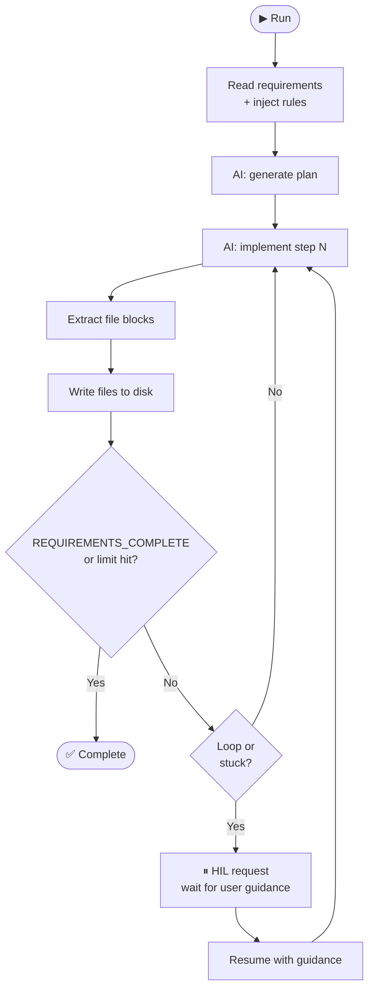
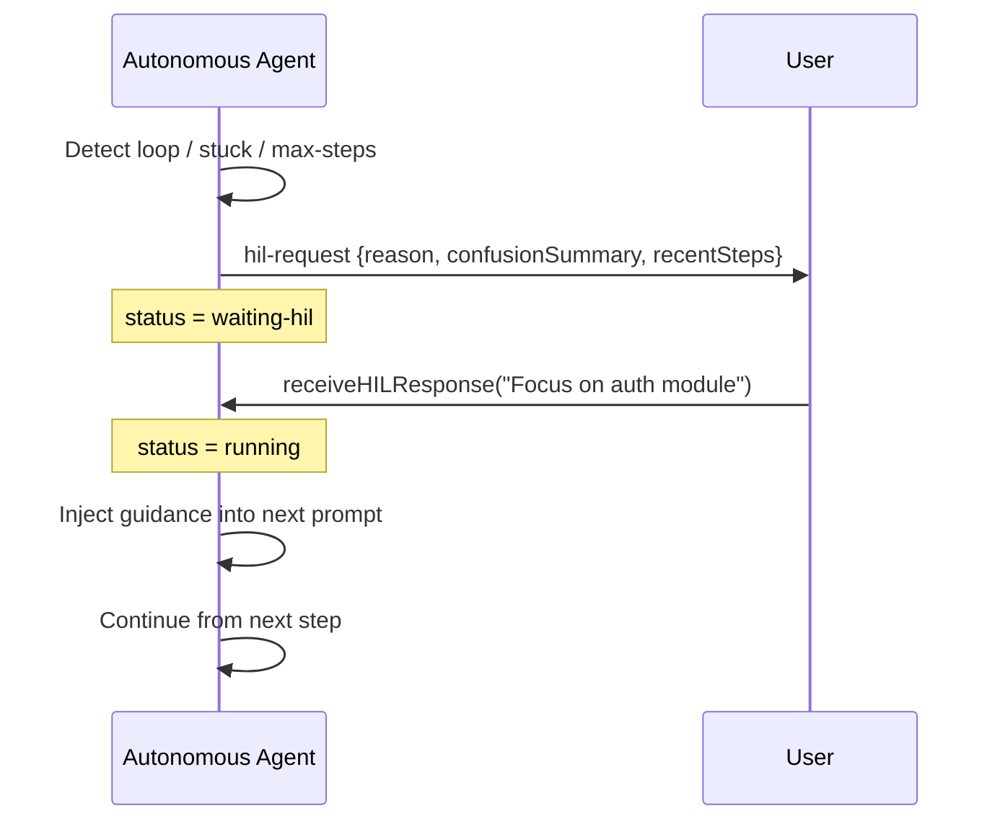

# Autonomous Agent

The Autonomous Vibe Agent reads a requirements file (or inline text), implements it step-by-step by writing files to disk, detects when it is looping or stuck, and asks for human guidance via a **Human-in-the-Loop (HIL)** modal when needed.

---

## How it Works



The agent stops when it outputs `REQUIREMENTS_COMPLETE`, hits the step or time limit, or the user manually stops it.

---

## Web UI (Recommended)

```bash
ai-agent ui
# Navigate to ⚡ Vibe Coder → 🤖 Autonomous tab
```

### Settings

| Setting                    | Description                                                |
| -------------------------- | ---------------------------------------------------------- |
| **Requirements file path** | Server-side path to a `.md` or `.txt` file                 |
| **Paste requirements**     | Paste requirements text directly                           |
| **Rules**                  | Constraints the agent must follow (one per line)           |
| **Time limit**             | Stop automatically after N seconds (`0` = no limit)        |
| **Max steps**              | Maximum iterations before a forced HIL check (default: 50) |

Click **▶ Run Autonomous** to start. Progress streams live. When a HIL event fires, a modal appears — type your guidance and click **Continue →**.

---

## CLI (Programmatic only)

The autonomous mode has no dedicated CLI command; use the Web UI or the programmatic API.

---

## Programmatic API

### Basic usage

```typescript
import { AgentCLI, AutonomousVibeAgent } from "fusion-agent";

const agent = new AgentCLI({ provider: "openai" });
const session = agent.createSession({
  name: "auto-build",
  speckit: "vibe-coder",
  projectDir: process.cwd(),
});

const autoAgent = new AutonomousVibeAgent(session, {
  requirementsFile: "./requirements.md",
  maxSteps: 50,
  timeLimitSeconds: 600,
});

autoAgent.on("step", (step) =>
  console.log(`Step ${step.stepNumber} — files:`, step.filesChanged),
);

autoAgent.on("complete", (steps) => {
  console.log(`Done in ${steps.length} steps`);
  agent.sessionManager.persistSession(session);
});

autoAgent.on("error", (err) => console.error(err.message));

await autoAgent.run();
```

### Inline requirements

```typescript
const autoAgent = new AutonomousVibeAgent(session, {
  requirementsContent: `
## Build a REST API

- Express server on port 3000
- GET /users returns a list of users
- POST /users creates a user
- Use TypeScript
`,
});
```

### With rules and loop detection tuning

```typescript
const autoAgent = new AutonomousVibeAgent(session, {
  requirementsFile: "./requirements.md",
  rules: [
    { id: "ts", description: "All files must be TypeScript" },
    { id: "no-class", description: "Use functional patterns, no classes" },
  ],
  maxSteps: 30,
  timeLimitSeconds: 300,
  loopWindowSize: 4, // compare last 4 responses
  loopSimilarityThreshold: 0.85, // 85% Jaccard similarity = loop
  stuckThreshold: 3, // 3 consecutive steps with no file changes = stuck
});
```

### Configuration reference

```typescript
interface AutonomousConfig {
  requirementsFile?: string; // path to .md or .txt
  requirementsContent?: string; // inline requirements text
  rules?: VibeCoderRule[]; // constraints injected into every step
  timeLimitSeconds?: number; // 0 = no limit
  maxSteps?: number; // default: 50
  stuckThreshold?: number; // default: 3
  loopWindowSize?: number; // default: 4
  loopSimilarityThreshold?: number; // default: 0.85 (Jaccard)
}

interface VibeCoderRule {
  id: string;
  description: string; // injected as constraint
}
```

---

## Events

| Event          | Payload                                  | Description                |
| -------------- | ---------------------------------------- | -------------------------- |
| `status`       | `AutonomousStatus`                       | Agent status changed       |
| `chunk`        | `(chunk: string, stepNumber: number)`    | Streaming token            |
| `file-changed` | `(filePath: string, stepNumber: number)` | File written               |
| `step`         | `(step: VibeCoderStep)`                  | Step completed             |
| `hil-request`  | `(request: HILRequest)`                  | Agent needs human guidance |
| `complete`     | `(steps: VibeCoderStep[])`               | Run finished               |
| `error`        | `(err: Error)`                           | Error occurred             |

### `VibeCoderStep` object

```typescript
{
  stepNumber: number;
  userMessage: string;
  assistantMessage: string;
  filesChanged: string[];
  timestamp: string;
}
```

---

## Human-in-the-Loop (HIL)



When the agent detects a problem it triggers a `hil-request` event with one of these reasons:

| Reason              | Description                                            |
| ------------------- | ------------------------------------------------------ |
| `loop-detected`     | Recent responses are too similar (Jaccard ≥ threshold) |
| `stuck`             | N consecutive steps produced no file changes           |
| `max-steps-reached` | Step count hit `maxSteps`                              |
| `error`             | An unrecoverable error occurred                        |

### Web UI

A modal appears automatically showing the reason, a confusion summary, and recent steps. Type guidance and click **Continue →**.

### Programmatic

```typescript
autoAgent.on("hil-request", (req) => {
  console.log("Reason:", req.reason);
  console.log("Confusion:", req.confusionSummary);
  console.log("Recent steps:", req.recentSteps);

  // Provide guidance and resume
  autoAgent.receiveHILResponse(
    "Ignore the database layer for now. Focus only on the Express routes.",
  );
});
```

---

## Status Values

```typescript
type AutonomousStatus =
  | "idle"
  | "running"
  | "waiting-hil"
  | "completed"
  | "stopped"
  | "timed-out";
```

Check status at any time:

```typescript
const status = autoAgent.getStatus();
const steps = autoAgent.getSteps();
```

---

## Stopping the Agent

```typescript
autoAgent.stop();
```

---

## Loop Detection

Loop detection uses **word-level Jaccard similarity** between the current response and the last `loopWindowSize` responses. If the similarity exceeds `loopSimilarityThreshold` the agent pauses for HIL.

Stuck detection counts consecutive steps with zero file changes. When this count reaches `stuckThreshold` a HIL request fires.

---

## Tips

- Supply a **detailed requirements file** with clear acceptance criteria — the agent uses it as a checklist.
- Add **rules** to encode team conventions (TypeScript, no anys, test coverage, etc.).
- Keep `maxSteps` conservative (30–50) and let HIL handle edge cases rather than increasing the limit.
- Set `timeLimitSeconds` as a safety net for CI/CD pipelines.
- After a run completes, call `agent.sessionManager.persistSession(session)` to save the full history.
