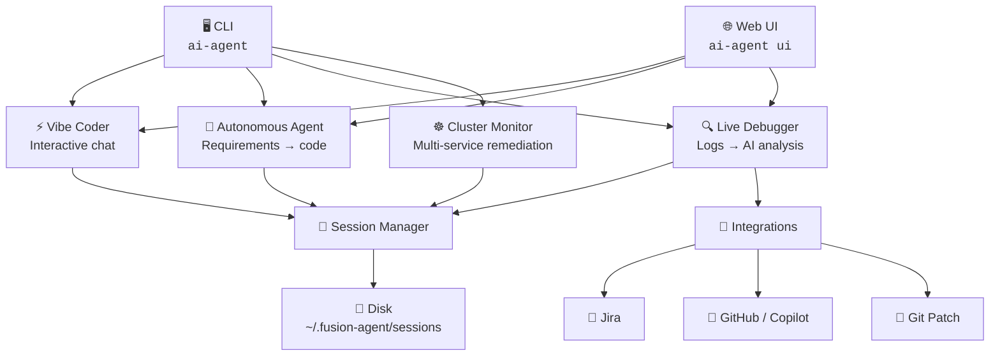

# fusion-agent Documentation

**fusion-agent** is an AI-powered developer toolkit that combines a vibe coder, live service debugger, autonomous coding agent, and session manager. It supports OpenAI, Anthropic, and Google Gemini and can be used as a CLI tool or imported as a TypeScript library.

---

## Documentation Index

| Document                                  | Description                                    |
| ----------------------------------------- | ---------------------------------------------- |
| [Getting Started](./getting-started.md)   | Installation, configuration, and first steps   |
| [CLI Reference](./cli-reference.md)       | All commands and options                       |
| [Vibe Coder](./vibe-coder.md)             | Interactive AI pair-programmer                 |
| [Autonomous Agent](./autonomous-agent.md) | Unattended coding with requirements files      |
| [Live Debugger](./live-debugger.md)       | Real-time log monitoring and AI analysis       |
| [Cluster Monitor](./cluster-monitor.md)   | Kubernetes / multi-service auto-remediation    |
| [Session Manager](./session-manager.md)   | Creating, persisting, and managing sessions    |
| [Web UI](./web-ui.md)                     | Browser dashboard for all features             |
| [Speckits](./speckits.md)                 | Prebuilt agent personas and system prompts     |
| [Guardrails](./guardrails.md)             | Safety rules for files, tokens, and operations |
| [Integrations](./integrations.md)         | Jira, GitHub, and Git patch integrations       |
| [Providers & Models](./providers.md)      | OpenAI, Anthropic, Gemini configuration        |
| [REST API](./rest-api.md)                 | HTTP and Socket.IO API reference               |
| [Deployment](./deployment.md)             | Docker, Docker Compose, and Kubernetes         |

---

## Feature Overview



## Quick Example

```bash
# Install
npm install -g fusion-agent

# Set API key
export OPENAI_API_KEY=sk-...

# Vibe Coder CLI
ai-agent chat

# Live Debugger
ai-agent debug --docker my-api --ui

# Web Dashboard
ai-agent ui
```
