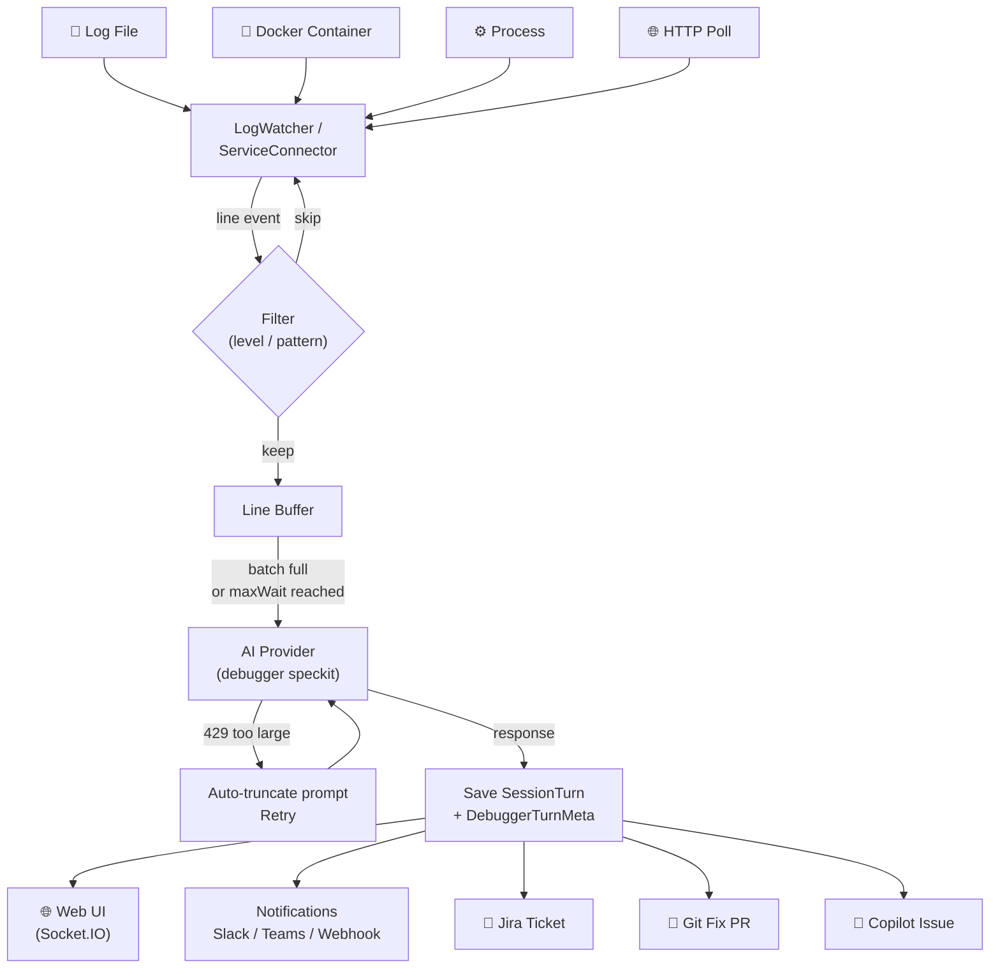
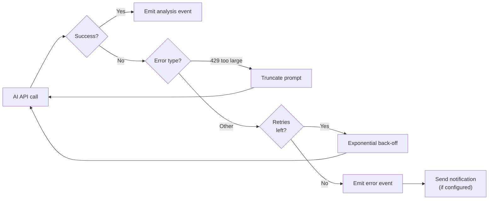

# Live Debugger

The Live Debugger tails log sources (files, Docker containers, processes, or HTTP endpoints), batches log lines, and sends them to an AI for analysis. Analysis results are pushed to the Web UI in real time via Socket.IO and can trigger Slack/Teams/webhook notifications, Jira tickets, Git fixes, and GitHub Copilot issue assignment.



---

## CLI

```bash
ai-agent debug [options]
```

### Connection options (one required)

| Flag                       | Description                                  |
| -------------------------- | -------------------------------------------- |
| `-f, --file <path>`        | Watch a log file                             |
| `-d, --docker <container>` | Attach to a Docker container's stdout/stderr |
| `-c, --cmd <command>`      | Spawn a process and capture its output       |

### Session & provider options

| Flag                    | Description  | Default              |
| ----------------------- | ------------ | -------------------- |
| `-p, --provider <name>` | AI provider  | From config          |
| `-m, --model <name>`    | Model name   | Provider default     |
| `-s, --session <name>`  | Session name | `live-debugger-<id>` |

### Batching and retry options

| Flag                    | Description                              | Default       |
| ----------------------- | ---------------------------------------- | ------------- |
| `--batch <n>`           | Log lines to buffer before sending to AI | `20`          |
| `--retry <n>`           | Max retry attempts per AI call           | `3`           |
| `--retry-delay <ms>`    | Base retry delay (exponential back-off)  | `1000`        |
| `--log-token-limit <n>` | Max tokens per prompt                    | Auto-detected |

### Filtering options

| Flag                       | Description                                                   |
| -------------------------- | ------------------------------------------------------------- |
| `--log-pattern <patterns>` | Comma-separated regex patterns — only matching lines are kept |
| `--log-level <levels>`     | Comma-separated log levels to watch (e.g. `ERROR,FATAL`)      |

### Notification options

| Flag                     | Description                 |
| ------------------------ | --------------------------- |
| `--notify-slack <url>`   | Slack incoming webhook URL  |
| `--notify-teams <url>`   | Microsoft Teams webhook URL |
| `--notify-webhook <url>` | Generic HTTP webhook URL    |

### Web UI options

| Flag            | Description                              | Default |
| --------------- | ---------------------------------------- | ------- |
| `--ui`          | Launch the Web UI alongside the debugger | —       |
| `--port <port>` | Web UI port when `--ui` is set           | `3000`  |

### Examples

```bash
# Tail a log file, watch only ERROR and FATAL
ai-agent debug --file /var/log/app.log --log-level ERROR,FATAL

# Attach to a Docker container, open Web UI on port 3000
ai-agent debug --docker my-api-container --ui

# Run a Node.js process and analyse its output
ai-agent debug --cmd "node server.js" --batch 10

# Full setup: docker + notifications + Web UI + named session
ai-agent debug \
  --docker my-api \
  --log-level ERROR,FATAL \
  --batch 15 \
  --retry 3 \
  --notify-slack https://hooks.slack.com/services/XXX/YYY/ZZZ \
  --session my-api-live-debug \
  --ui --port 3000
```

---

## Programmatic API

### `LiveDebugger` class

```typescript
import { AgentCLI, LiveDebugger } from "fusion-agent";

const agent = new AgentCLI({ provider: "openai" });
const session = agent.createSession({
  name: "live-debugger-prod",
  speckit: "debugger",
});

const debugger_ = new LiveDebugger({
  session,
  batchSize: 15,
  maxWaitSeconds: 30,
  logLevels: ["ERROR", "FATAL"],
  retryCount: 3,
  retryDelayMs: 1000,
  notifications: {
    slack: { enabled: true, webhookUrl: process.env.SLACK_WEBHOOK! },
  },
  onAnalysis: (analysis) => {
    console.log("AI Analysis:", analysis);
    agent.sessionManager.persistSession(session);
  },
});

// Always attach an error handler to avoid unhandled-error crashes
debugger_.on("error", (err) => console.error("Debugger error:", err.message));
```

### Constructor options

```typescript
interface LiveDebuggerOptions {
  session: Session;
  batchSize?: number; // default: 20
  maxWaitSeconds?: number; // default: 30
  retryCount?: number; // default: 3
  retryDelayMs?: number; // default: 1000
  logPatterns?: string[]; // regex patterns — filter lines
  logLevels?: string[]; // e.g. ['ERROR', 'WARN']
  logTokenLimit?: number; // auto-detected from 429 errors
  notifications?: NotificationConfig;
  onAnalysis?: (analysis: string, meta?: DebuggerTurnMeta) => void;
  onLog?: (line: string) => void;
  io?: SocketIOServer; // pass server.io for real-time Web UI pushes
}
```

### Connecting to a log source

```typescript
// Watch a file
debugger_.watchLogFile("/var/log/app.log", /* tailLines */ 50);

// Docker container
debugger_.connectToService({ type: "docker", container: "my-api" });

// Spawn a process
debugger_.connectToService({
  type: "process",
  command: "node",
  args: ["server.js"],
  cwd: "/home/ubuntu/app",
});

// HTTP health-check polling
debugger_.connectToService({
  type: "http-poll",
  url: "http://localhost:8080/health",
  intervalMs: 5000,
  headers: { Authorization: "Bearer token" },
});

// Clean up
process.on("SIGINT", () => debugger_.stop());
```

### Events

| Event            | Payload                                       | Description                             |
| ---------------- | --------------------------------------------- | --------------------------------------- |
| `log`            | `(line: string)`                              | Raw log line received                   |
| `analysis`       | `(analysis: string, meta?: DebuggerTurnMeta)` | AI analysis complete                    |
| `analysis-chunk` | `(chunk: string)`                             | Streaming token from AI                 |
| `error`          | `(err: Error)`                                | Error occurred (debugger keeps running) |
| `exit`           | `(code: number)`                              | Watched process exited                  |

### `DebuggerTurnMeta` object

Available in the `onAnalysis` callback and on `session.turns[n].debuggerMeta`:

```typescript
{
  matchedLogLines: string[];     // log lines that triggered this analysis
  promptSentAt: string;          // ISO timestamp
  responseReceivedAt: string;    // ISO timestamp
  notificationSent: boolean;
  fixApplied: boolean;
  jiraKey?: string;              // set if Jira ticket was created
  gitFixUrl?: string;            // set if a Git PR was opened
  copilotIssueUrl?: string;      // set if a Copilot issue was filed
}
```

---

## Connecting to the Web UI

Pass the Socket.IO instance from `createWebServer` to push live log lines and analysis cards to the browser:

```typescript
import { AgentCLI, LiveDebugger, createWebServer } from "fusion-agent";

const agent = new AgentCLI({ provider: "openai" });
const session = agent.createSession({
  name: "prod-debug",
  speckit: "debugger",
});

const server = createWebServer({
  port: 3000,
  sessionManager: agent.sessionManager,
  provider: "openai",
});
await server.start();

const debugger_ = new LiveDebugger({
  session,
  io: server.io, // ← real-time Web UI pushes
  onAnalysis: () => agent.sessionManager.persistSession(session),
});

debugger_.on("error", (err) => console.error(err.message));
debugger_.connectToService({ type: "docker", container: "my-api" });
```

Open `http://localhost:3000` → Sessions → find the `🔍 prod-debug` session → click **Subscribe Live**.

---

## Log Filtering

### By level

```bash
ai-agent debug --docker my-app --log-level ERROR,FATAL,WARN
```

Only lines containing the specified level keywords are forwarded to the AI.

### By regex pattern

```bash
ai-agent debug --file app.log --log-pattern "OOM|out of memory,connection refused"
```

Multiple patterns are comma-separated; a line matching any pattern is kept.

---

## Token Limit Handling

If the AI returns a `429 Request too large` error, fusion-agent automatically:

1. Extracts the token limit from the error message.
2. Truncates the prompt to fit.
3. Retries the request.

To set the limit proactively and skip the first failure:

```bash
ai-agent debug --docker my-app --log-token-limit 25000
```

---

## Notifications

### Slack

```bash
ai-agent debug --docker my-app --notify-slack https://hooks.slack.com/services/XXX/YYY/ZZZ
```

### Microsoft Teams

```bash
ai-agent debug --docker my-app --notify-teams https://outlook.office.com/webhook/...
```

### Generic webhook

```bash
ai-agent debug --docker my-app --notify-webhook https://my-webhook.example.com/alerts
```

Programmatic config:

```typescript
notifications: {
  slack:   { enabled: true, webhookUrl: "https://hooks.slack.com/..." },
  teams:   { enabled: true, webhookUrl: "https://outlook.office.com/..." },
  webhook: { enabled: true, url: "https://my-webhook.example.com/alerts" },
  pagerduty: { enabled: true, routingKey: "abc123" },
}
```

---

## Error Resilience



| Scenario              | Behaviour                                |
| --------------------- | ---------------------------------------- |
| AI call fails         | Retried with exponential back-off        |
| 429 Request too large | Prompt auto-truncated; retried           |
| All retries exhausted | `error` event emitted; notification sent |
| Log file not found    | `error` event emitted; no crash          |
| Watched process exits | `exit` event emitted                     |
| Web UI not connected  | Socket.IO `emit` is a no-op              |

Always attach an `error` listener:

```typescript
debugger_.on("error", (err) => {
  console.error("Debugger error:", err.message);
  // The debugger keeps running
});
```

---

## Post-Analysis Actions

After an analysis card appears in the Web UI, you can:

- **🎫 Create Jira Ticket** — file a ticket from the analysis
- **⚙ Apply Git Fix** — apply AI code blocks to a local repo and open a PR
- **🤖 Assign to Copilot** — create a GitHub issue assigned to the Copilot coding agent

See [Integrations](./integrations.md) for configuration details.
