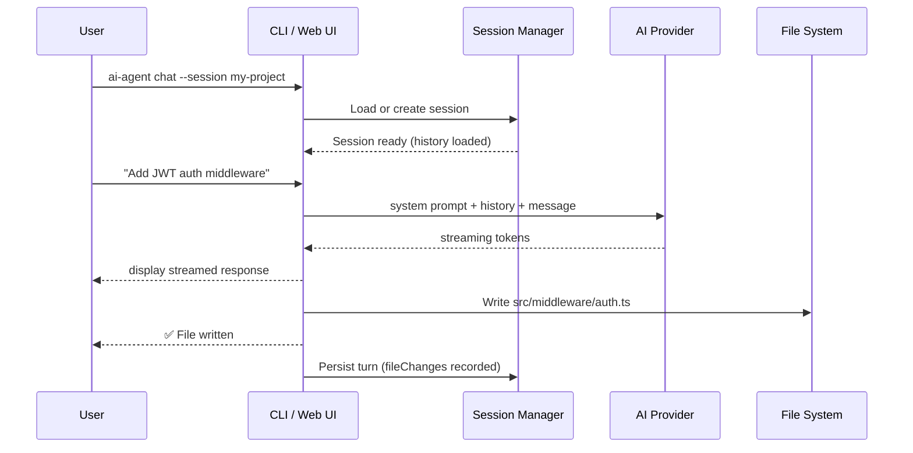

# Vibe Coder

The Vibe Coder is an AI pair-programmer that reads your project context, generates code, refactors files, and writes them to disk automatically. It has two modes: **interactive chat** and **autonomous** (unattended).



---

## CLI — Interactive Chat

```bash
ai-agent chat
```

### Options

| Flag                     | Description                                       | Default          |
| ------------------------ | ------------------------------------------------- | ---------------- |
| `-p, --provider <name>`  | AI provider (`openai` \| `anthropic` \| `gemini`) | From config      |
| `-m, --model <name>`     | Model name (e.g. `gpt-4o`)                        | Provider default |
| `-s, --session <name>`   | Session name — creates or resumes                 | `default`        |
| `-k, --speckit <name>`   | Speckit to use                                    | `vibe-coder`     |
| `-g, --guardrail <rule>` | Add a guardrail rule (repeatable)                 | —                |
| `--context`              | Inject project directory structure as context     | —                |

### Examples

```bash
# Basic interactive session
ai-agent chat

# Resume a named session with context injection
ai-agent chat --session my-project --context

# Use Anthropic with a guardrail
ai-agent chat \
  --provider anthropic \
  --model claude-3-5-sonnet-20241022 \
  --guardrail "All files must be TypeScript strict mode"

# Use multiple guardrails
ai-agent chat \
  --guardrail "Use React functional components only" \
  --guardrail "No inline styles"
```

### In-session commands

Inside an active chat session:

| Command            | Action                                     |
| ------------------ | ------------------------------------------ |
| `/exit` or `/quit` | End session and save                       |
| `/save`            | Save current session without ending        |
| `/turns`           | Show conversation history                  |
| `/context`         | Inject current project directory structure |

---

## How File Generation Works

````mermaid
flowchart LR
    A["AI response text"] --> B{"Contains\n```lang:path\n``` block?"}
    B -- No --> C["Display to user only"]
    B -- Yes --> D["Extract path + content"]
    D --> E{"Guardrail check"}
    E -- Blocked --> F["Skip write, warn user"]
    E -- Allowed --> G["Write file to disk"]
    G --> H["Record FileChange in turn"]
    H --> I["Emit file-changed event"]
````

When the AI produces a code block with a file path in the fence:

````
```typescript:src/server.ts
// full file content
```
````

fusion-agent automatically writes that content to `src/server.ts` on disk and records the change in the session turn. You can revert the change programmatically with `session.revertTurnChanges(turnId)`.

---

## Programmatic API

### Basic usage

```typescript
import { AgentCLI } from "fusion-agent";

const agent = new AgentCLI({
  provider: "openai",
  model: "gpt-4o",
  apiKey: process.env.OPENAI_API_KEY,
});

// One-shot prompt
const response = await agent.chat("Write a Node.js HTTP server in TypeScript");
console.log(response);
```

### Session-based chat

```typescript
import { AgentCLI, createGuardrail } from "fusion-agent";

const agent = new AgentCLI({ provider: "openai" });

const session = agent.createSession({
  name: "my-project",
  speckit: "vibe-coder",
  projectDir: "/home/user/my-project",
  guardrails: [
    createGuardrail("custom", "Use TypeScript strict mode"),
    createGuardrail("deny-paths", ["secrets/", ".env"]),
  ],
});

// Streaming turn
const turn = await session.chat("Add JWT authentication middleware", {
  stream: true,
  onChunk: (chunk) => process.stdout.write(chunk),
});

console.log("Files changed:", turn.fileChanges);

// Revert all file changes from this turn
session.revertTurnChanges(turn.id);

// Save session
agent.sessionManager.persistSession(session);
```

### Session turn object

Each `session.chat()` call returns a `SessionTurn`:

```typescript
{
  id: string;
  timestamp: string;
  userMessage: string;
  assistantMessage: string;
  fileChanges?: Array<{
    filePath: string;
    previousContent: string | null;
    newContent: string;
  }>;
  usage?: {
    promptTokens: number;
    completionTokens: number;
    totalTokens: number;
  };
}
```

---

## Injecting Project Context

Send the current project directory tree as context before asking coding questions. This helps the AI understand the existing structure.

**CLI:**

```bash
ai-agent chat --context          # inject at start
# or inside the session:
/context
```

**Programmatic:**

```typescript
// The vibe:inject-context socket event does this in the Web UI.
// Programmatically, include the context string in your message:
import { gatherProjectContext } from "fusion-agent";

const ctx = await gatherProjectContext("/home/user/my-project");
const turn = await session.chat(
  `Here is my project:\n\n${ctx}\n\nNow add a REST endpoint for /users`,
);
```

---

## Autonomous Mode

For unattended coding from a requirements file, see [Autonomous Agent](./autonomous-agent.md).

---

## Web UI

Access Vibe Coder from the browser dashboard:

```bash
ai-agent ui
# Open http://localhost:3000 → ⚡ Vibe Coder
```

See [Web UI](./web-ui.md) for a full walkthrough of the Chat and Autonomous tabs.

---

## Tips

- **Name your sessions** with `--session` so you can resume work later.
- **Use `--context`** on the first message to give the AI full knowledge of your project layout.
- **Chain guardrails** to enforce team conventions (e.g. no `any`, use functional components).
- **Revert bad changes** with `session.revertTurnChanges(turnId)` or delete the session from the Web UI.
